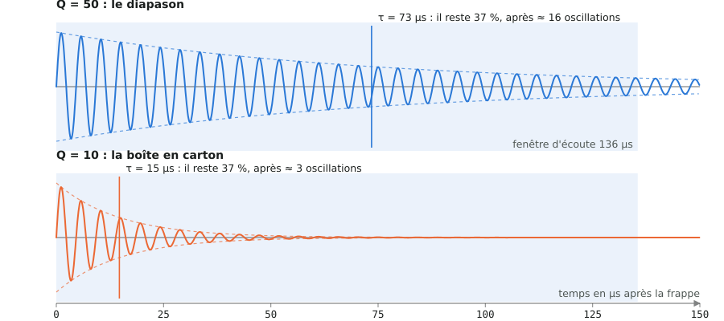
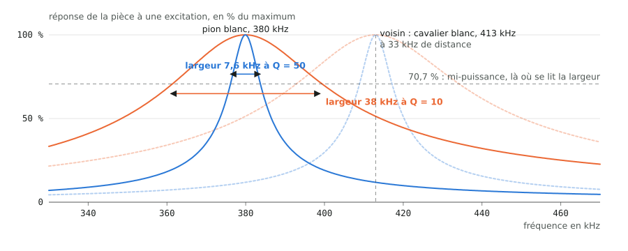
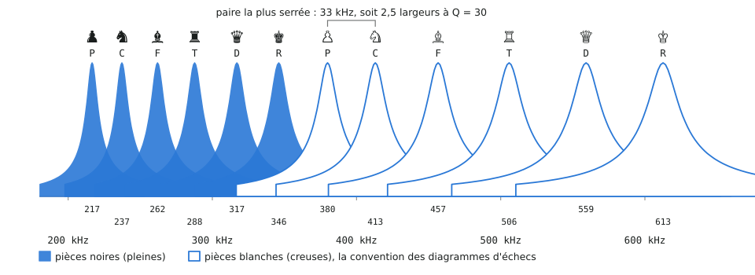
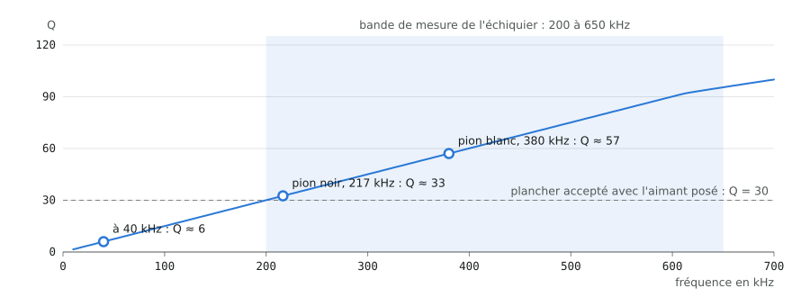
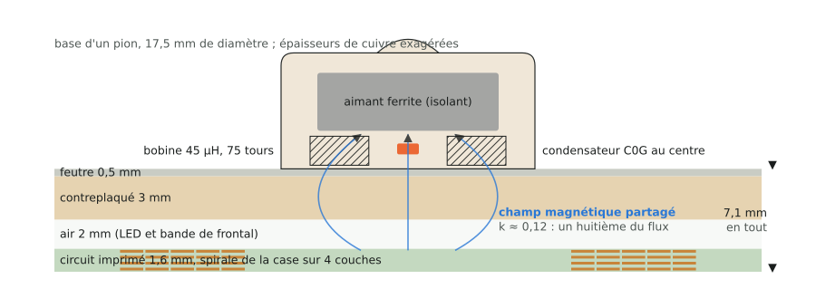
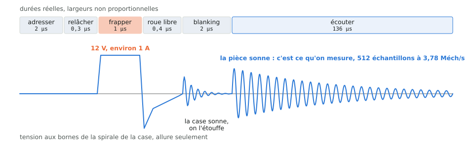
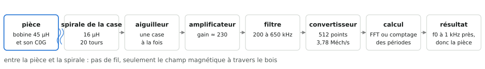

# 18. Le facteur Q, expliqué sans électronique

Cette note s'adresse à quelqu'un qui découvre le projet sans bagage
en électronique. Chaque pièce de l'échiquier contient un petit circuit
qui « sonne » à une note précise quand on l'excite ; Q dit combien de
temps la note dure et à quel point elle est pure. Les chiffres cités
sont ceux imprimés par `python -m chessboard_calc.report` le
17/09/2026 depuis `config/board.yaml` ; les schémas sont produits par
`python -m docfig build` depuis les mêmes fonctions (runbook,
[note 08](08-regenerer.md)).

À retenir :

- Q est un nombre sans unité. Plus il est grand, plus l'oscillation
  dure et plus la note est fine.
- Pour l'échiquier, Q décide si deux pièces voisines restent
  distinguables. Le projet vise Q = 50 et accepte au minimum 30 une
  fois l'aimant posé (`resonator.q_nominal`, `q_min_with_magnet`).
- Ce qui fait baisser Q : la résistance du fil de la bobine, le métal
  à proximité, et tout ce qui absorbe l'énergie de l'oscillation.

## 1. L'image à retenir : le diapason et la boîte en carton

Frappez un diapason : il vibre longtemps sur une note nette. Frappez
une boîte en carton : un « toc » sourd, fini aussitôt. Le diapason a
un Q élevé, la boîte un Q faible. Dans le projet, la pièce est le
diapason. La case la « frappe » par une brève impulsion magnétique,
puis écoute sa note décroître : c'est le ringdown de la
[note 01](01-principe-de-mesure.md).

Q se lit directement sur cette décroissance. Comptez les oscillations
visibles avant que la note ne s'éteigne : vous avez à peu près Q. Plus
précisément, après Q/π oscillations il reste 37 % de l'amplitude, et
après Q oscillations il en reste 4 %.

Un pion noir sonne à 217 kHz. Avec Q = 50, la sonnerie remplit la
fenêtre d'écoute de 136 µs (τ = 73 µs). Avec Q = 10 elle est éteinte
au bout de 15 µs environ : il reste peu de périodes à analyser, et la
note est floue.

## 2. Ce que Q mesure exactement

Une oscillation, c'est de l'énergie qui fait l'aller-retour entre deux
réservoirs. Pour une balançoire : la hauteur et la vitesse. Pour notre
circuit : le champ magnétique de la bobine (L) et la charge du
condensateur (C). À chaque aller-retour, une fraction part en chaleur
dans la résistance du fil (R). Q compte, à un facteur 2π près,
combien d'allers-retours la réserve d'énergie permet avant d'être
épuisée.

| Formule | Ce qu'elle dit |
|---|---|
| Q = 2π · énergie stockée / énergie perdue par période | la définition, sans unité |
| f0 = 1 / (2π √(L·C)) | la note ; une seule bobine pour toutes les pièces, douze condensateurs pour douze notes |
| Q = 2π·f0·L / R | pour notre circuit : la bobine stocke, sa résistance perd ; le numérateur grandit avec la fréquence |
| Δf = f0 / Q | la largeur de la note, lue à mi-puissance ; Q élevé, note fine |
| τ = Q / (π·f0) | le temps au bout duquel il reste 37 % de l'amplitude |

Les chiffres du projet : bobine de 45 µH commune à toutes les pièces,
condensateurs C0G à 1 % de 1,5 à 12 nF, douze notes de 217 à 613 kHz.
À Q = 50, les notes ont 4,3 à 12,3 kHz de large et durent τ = 73 à
26 µs. À Q = 30, le plancher accepté avec l'aimant, elles s'élargissent
à 7,2 à 20,4 kHz.

## 3. La même chose vue comme une note

Un résonateur ne répond fort que tout près de sa note. La largeur de
sa réponse vaut f0/Q. Avec un Q élevé la raie est fine et se distingue
facilement de la voisine ; avec un Q faible elle s'étale et les deux
se confondent. La paire la plus serrée du projet est le pion blanc à
380 kHz et le cavalier blanc à 413 kHz, à 33 kHz l'un de l'autre.

À Q = 50, le pion blanc a une raie de 7,6 kHz : le cavalier est à 4,2
largeurs, sans ambiguïté. À Q = 10, la raie fait 38 kHz, plus que
l'écart entre les deux notes : les réponses se recouvrent (courbes
pointillées du voisin).

Point important pour les discussions sur « les fréquences trop
élevées » : la largeur relative 1/Q ne dépend pas de la fréquence.
Descendre ou monter la bande ne rapproche ni n'éloigne les notes.
Seul Q compte, et Q dépend de la fréquence, comme la section 5 le
montre.

## 4. Douze pièces, douze notes

Six types de pièces fois deux camps font douze classes. Chacune reçoit
un condensateur de la série E12 ; les notes s'échelonnent de 217 à
613 kHz. Le plateau ne cherche pas une précision absolue : il mesure
la note de chaque pièce une fois pour toutes en calibration, puis
classe chaque lecture au plus proche voisin. Il suffit donc que les
raies ne se recouvrent pas, même à Q = 30.

Pièces noires pleines, blanches creuses, comme sur un diagramme
d'échecs. La paire la plus serrée reste séparée de 2,5 largeurs de
raie ; `tests/test_resonance.py` casse si une modification du yaml
passe sous le plancher `min_separation_widths` de 2,4.

| Pièce | C (nF) | f0 (kHz) | largeur à Q = 50 (kHz) | largeur à Q = 30 (kHz) | τ à Q = 50 (µs) |
|---|---|---|---|---|---|
| pion noir | 12 | 216,6 | 4,3 | 7,2 | 73 |
| cavalier noir | 10 | 237,3 | 4,7 | 7,9 | 67 |
| fou noir | 8,2 | 262,0 | 5,2 | 8,7 | 61 |
| tour noire | 6,8 | 287,7 | 5,8 | 9,6 | 55 |
| dame noire | 5,6 | 317,0 | 6,3 | 10,6 | 50 |
| roi noir | 4,7 | 346,1 | 6,9 | 11,5 | 46 |
| pion blanc | 3,9 | 379,9 | 7,6 | 12,7 | 42 |
| cavalier blanc | 3,3 | 413,0 | 8,3 | 13,8 | 39 |
| fou blanc | 2,7 | 456,6 | 9,1 | 15,2 | 35 |
| tour blanche | 2,2 | 505,8 | 10,1 | 16,9 | 31 |
| dame blanche | 1,8 | 559,2 | 11,2 | 18,6 | 28 |
| roi blanc | 1,5 | 612,6 | 12,3 | 20,4 | 26 |

## 5. D'où vient le Q d'une pièce, et pourquoi la bande est là où elle est

Q = 2π·f0·L / R : le numérateur grandit avec la fréquence, le
dénominateur (la résistance du fil) ne grandit que lentement, par
l'effet de peau. Pour une bobine plate bobinée main de 45 µH, Q monte
donc avec la fréquence jusqu'à quelques mégahertz, où la capacité
parasite du bobinage et de l'aiguilleur reprend la main. La bande de
mesure du projet, 200 à 650 kHz, est posée sur cette montée.

Bobine du pion, 75 tours de fil de 0,25 mm, avec le modèle simplifié
du dépôt (`inductance.coil_esr_ohm`, facteur de proximité 2,5). À
40 kHz, Q ≈ 6 : trop peu. Dans la bande, 33 pour le pion noir et 57
pour le pion blanc. La mesure M1 du protocole remplace ces
estimations par la réalité.

Deux autres raisons tiennent la bande où elle est. Dix fois plus bas,
il faudrait des condensateurs de 15 à 120 nF, où le C0G à 1 % n'existe
plus, or c'est sa stabilité thermique qui porte l'identité des pièces.
Et τ = Q/(π·f0) : à fréquence dix fois plus basse, chaque case
mettrait dix fois plus longtemps à sonner, et un balayage complet des
64 cases passerait de 0,13 s à 1,3 s.

## 6. Ce qui abîme Q

- **La résistance du fil.** C'est la perte de base, fixée par le
  diamètre du fil et le nombre de tours. Le dépôt choisit le plus gros
  fil qui tient dans la base de chaque pièce
  (`resonator.coil.wire_candidates_mm`).
- **Le métal à proximité.** Un objet conducteur près de la bobine voit
  naître des courants de Foucault qui volent de l'énergie à chaque
  période. Un aimant néodyme (conducteur) dans la pièce aurait ruiné
  Q ; le projet a choisi une ferrite, isolante ([ADR 0002](../adr/0002-hard-ferrite-piece-magnets.md)).
  La mesure M2 vérifie que Q reste au-dessus de 30 avec l'aimant posé :
  c'est la mesure décisive du projet.
- **Ce qui est branché sur la bobine.** Côté plateau, une résistance
  de 680 ohms est justement mise aux bornes de la spirale de la case
  pendant 2 µs pour tuer sa propre sonnerie (le blanking de la
  [note 17](17-quadrant-fonction-et-cablage.md)) : on veut Q élevé
  pour la pièce, Q faible pour la case au moment d'écouter.
- **La pièce voisine.** Deux résonateurs proches se couplent et se
  prêtent de l'énergie. Le budget de diaphonie entre cases est de
  -20 dB (`measurement.crosstalk_max_db`, mesure M5).

## 7. Comment le plateau frappe et écoute

Sous chaque case, une spirale gravée dans le circuit imprimé joue le
rôle de la baguette et de l'oreille. Entre elle et la bobine de la
pièce : 7,1 mm de circuit imprimé, d'air, de contreplaqué et de feutre.
Environ un huitième du champ magnétique traverse les deux bobines
(k ≈ 0,12, `coupling.coupling`), et cela suffit.

La bobine plate est au fond de la base, le condensateur C0G dans son
trou central, l'aimant ferrite au-dessus. Le champ magnétique commun
aux deux bobines porte la note à travers le bois.

Une mesure dure environ 141 µs. L'impulsion de 12 V est brève et large
bande : elle excite toutes les notes possibles à la fois, sans
balayage. Le blanking étouffe la sonnerie propre de la spirale de la
case ; ensuite seule la pièce sonne, et le convertisseur enregistre
512 points à 3,78 Méch/s (la cadence réelle du firmware du cerveau,
`firmware/board/src/adc.c` ; le yaml retient 4 Méch/s pour les
estimations).

Le calcul extrait la fréquence de la sonnerie à 1 kHz près, par
transformée de Fourier ou par comptage des périodes
([ADR 0007](../adr/0007-frequency-extraction-dual-path.md)) ; les
notes étant espacées de 21 kHz au minimum, la pièce et son camp en
découlent.

## 8. Lexique

| Mot | Sens dans le projet |
|---|---|
| Résonateur LC | une bobine (L) et un condensateur (C) en boucle : le circuit le plus simple qui sache osciller |
| Fréquence propre f0 | la note à laquelle le résonateur sonne naturellement, fixée par L et C |
| Ringdown | la sonnerie qui décroît après la frappe ; c'est elle que le plateau enregistre |
| Largeur de raie | la plage de fréquences sur laquelle le résonateur répond fort, égale à f0/Q |
| τ (tau) | la constante de temps de la décroissance : au bout de τ il reste 37 % de l'amplitude |
| C0G | une famille de condensateurs céramiques dont la valeur ne bouge presque pas avec la température ni le temps ; c'est ce qui rend la note d'une pièce stable |
| Courants de Foucault | courants induits dans un métal par un champ magnétique variable ; ils chauffent le métal et volent l'énergie de l'oscillation |
| Blanking | les 2 µs pendant lesquelles on étouffe volontairement la spirale de la case avant d'écouter la pièce |
| FFT | la transformée de Fourier rapide : le calcul qui transforme un enregistrement dans le temps en liste de notes présentes |
| Diaphonie | la part du signal d'une case qui fuit vers la case voisine |

Les Q de bobine de cette note sont des estimations de conception ; les
mesures M1 et M2 du [protocole](../../measurements/protocol.md)
donnent les valeurs réelles.
