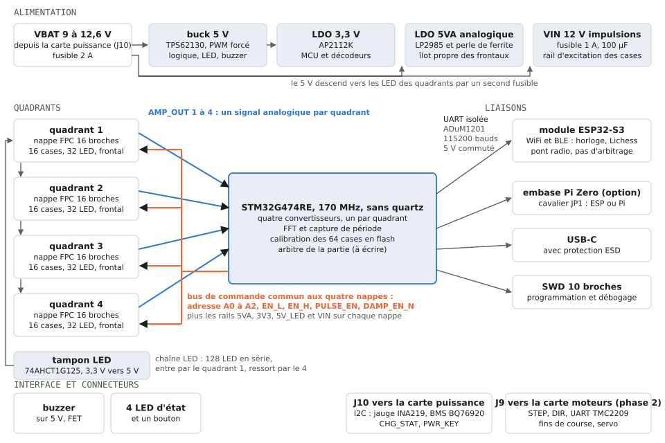
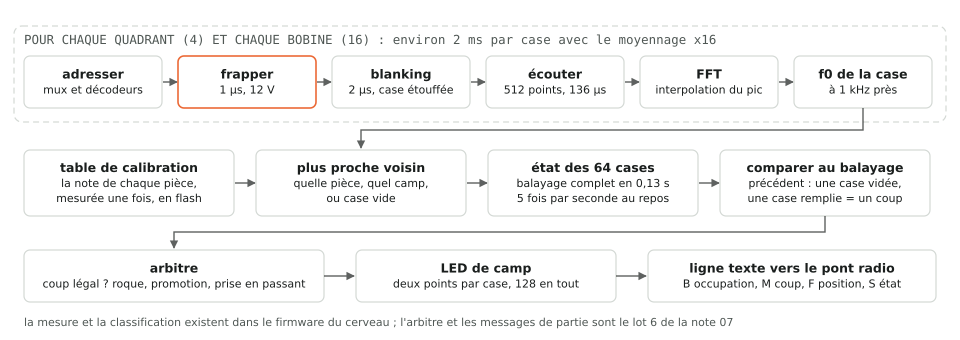
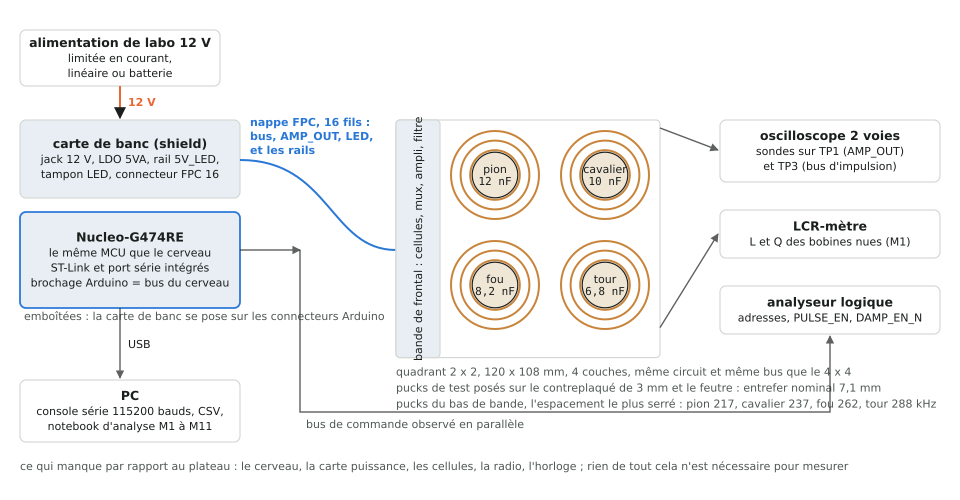

# 19. Le cerveau et le banc Nucleo, expliqués

Suite de la [note 18](18-facteur-q.md), pour le même lecteur : ce que
fait la carte cerveau du plateau, et comment un banc réduit autour
d'une carte de développement Nucleo, sans cerveau ni carte puissance,
va confronter les grandeurs physiques calculées à la réalité. Les
schémas sont produits par `python -m docfig build` depuis
`config/board.yaml` ; les chiffres viennent du rapport
`python -m chessboard_calc.report` du 17/09/2026.

## 1. À quoi sert le cerveau

Le plateau est fait de quatre quadrants identiques (chacun 16 cases,
32 LED et son frontal analogique, [note 17](17-quadrant-fonction-et-cablage.md))
posés sous le contreplaqué, et d'une carte cerveau au fond de la base.
Le cerveau est le chef d'orchestre : il décide quelle case on mesure,
frappe, écoute, calcule la note, en déduit la pièce, compare deux
balayages pour trouver le coup joué, allume les LED de camp et
raconte la partie au pont radio. Il ne contient aucune électronique
de mesure fine : l'amplification et le filtrage sont sur les
quadrants, le cerveau ne reçoit que quatre signaux déjà amplifiés.

## 2. Ce qu'il y a dessus, bloc par bloc

Le circuit est décrit dans `tools/boardgen/brain.py`, le brochage dans
`plateau.brain.mcu_pins` du yaml, la carte dans `hardware/brain/`.

| Bloc | Composants | Rôle |
|---|---|---|
| Microcontrôleur | STM32G474RE, 170 MHz, sans quartz, SWD, USB-C | mesure, calcul, calibration en flash, arbitre (à écrire), protocole |
| Alimentation | fusible 2 A, buck 5 V TPS62130 en PWM forcé, LDO 3,3 V AP2112K | le 5 V nourrit la logique, les LED et le buzzer ; le 3,3 V le MCU et les décodeurs des quadrants |
| Îlot analogique | LDO 5 V LP2985, perle de ferrite, découplages | un 5 V propre, séparé du 5 V numérique, pour les aiguilleurs, l'amplificateur et les filtres des quadrants ([ADR 0005](../adr/0005-power-and-noise-architecture.md)) |
| Rail d'impulsion | fusible 1 A, 100 µF | le 12 V de la batterie envoyé tel quel aux quadrants pour frapper les bobines |
| Rail LED | fusible 2 A, 100 µF | le 5 V des 128 LED, séparé pour que leurs appels de courant ne remontent pas |
| Liens quadrant | quatre connecteurs FPC 16 broches Hirose FH12 | un bus de commande commun (adresse A0 à A2, deux enables, PULSE_EN, DAMP_EN_N), un signal AMP_OUT par quadrant vers un convertisseur dédié (ADC1 à ADC4), les rails |
| Chaîne LED | tampon 74AHCT1G125 | passe le signal de 3,3 V à 5 V, entre dans le quadrant 1, ressort, entre dans le 2, et ainsi de suite jusqu'au 4 |
| Communication | ADuM1201, interrupteur de charge, ESP32-S3-WROOM-1, embase Pi Zero, cavalier JP1 | une UART isolée à 115200 bauds vers le pont radio (WiFi et BLE), ou vers un Pi en option ; le pont ne fait que relayer ([note 12](12-protocole.md)) |
| Interface | buzzer sur FET, quatre LED d'état, bouton | signaux au joueur |
| Connecteurs | J10 vers la carte puissance (VBAT, I2C jauge et BMS, CHG_STAT, PWR_KEY), J9 vers la carte moteurs (phase 2) | le cerveau n'embarque ni batterie ni moteurs |

Trois idées à garder :

- **Un seul bus pour quatre quadrants.** Les quatre nappes reçoivent
  les mêmes fils de commande ; seul l'enable du bon quadrant est
  actif. Le cerveau ne mesure jamais deux cases à la fois.
- **L'analogique reste court.** Le seul signal fragile qui traverse
  une nappe est AMP_OUT, déjà amplifié 230 fois ; le signal brut en
  microvolts ne quitte jamais le quadrant ([ADR 0004](../adr/0004-four-quadrant-sensing-pcb.md)).
- **Rien de numérique n'émet pendant qu'on écoute.** Le buck découpe
  au-dessus de 2 MHz, hors de la bande 200 à 650 kHz ; les trames LED
  ne partent qu'entre deux mesures ; la radio est coupée pendant les
  balayages.

## 3. Ce qu'il fait, dans le temps

Pour chaque quadrant et chaque bobine, le firmware
(`firmware/board/src/measure.c`) adresse la case, frappe pendant 1 µs
depuis le 12 V, étouffe la spirale pendant 2 µs, écoute 512 points à
3,78 Méch/s, calcule la FFT et interpole le pic : une fréquence à
1 kHz près. Avec le moyennage x16, une case coûte environ 2 ms et un
balayage complet des 64 cases 0,13 s ; au repos le plateau balaie
5 fois par seconde.

La classification est au plus proche voisin contre une table de
calibration : la note de chaque pièce, mesurée une fois et stockée en
flash (`calib.c`). Deux balayages successifs qui diffèrent (une case
vidée, une case remplie) font un coup. L'arbitre (coup légal, roque,
promotion, prise en passant) et les messages de partie `B`, `M`, `F`,
`S` de la [note 12](12-protocole.md) sont le lot 6 de la
[note 07](07-etat-et-reste-a-faire.md) : le firmware d'aujourd'hui
mesure et classe, il ne joue pas encore.

## 4. Pourquoi un banc Nucleo avant le cerveau

Le projet repose sur une hypothèse physique qui n'a été que
calculée : un résonateur passif sous aimant ferrite reste discriminable
à travers 7,1 mm de bois et d'air. Tant qu'elle n'est pas mesurée,
fabriquer le cerveau, la carte puissance et l'horloge revient à
construire autour d'une inconnue. Or rien de tout cela n'est
nécessaire pour mesurer :

- la **Nucleo-G474RE** porte le même microcontrôleur que le cerveau,
  avec sa sonde de programmation et son port série intégrés ; le
  brochage du bus de commande retenu pour le cerveau tombe sur son
  connecteur Arduino ;
- le **quadrant réduit 2 x 2** (`hardware/quadrant-2x2/`) porte le
  même circuit, le même bus et le même firmware que le 4 x 4, avec
  quatre cases au lieu de seize ; ce qu'il valide se reporte sans
  redessin, le générateur étant paramétré par le nombre de cases ;
- il manque au banc un 12 V, un 5 V analogique propre et un tampon
  LED : trois composants, pas trois cartes.

La multiplication du 2 x 2 en seize tuiles pour couvrir 64 cases
n'est en revanche pas possible avec cette carte : sa bande de frontal
de 20 mm et son dépassement de 8 mm laisseraient des vides entre les
cases. La [note 16](16-cout-des-cartes.md), section 3, explique
pourquoi une tuile de 100 x 100 mm ne peut pas porter son frontal ;
le chemin retenu est 2 x 2 comme banc, quadrants 4 x 4 pour le plateau.

## 5. Le banc, pièce par pièce

| Élément | Rôle | État |
|---|---|---|
| Nucleo-G474RE | le MCU, la programmation, la console série | du commerce ; firmware `make NUCLEO=1` |
| Quadrant 2 x 2 assemblé | quatre cases, frontal complet, huit LED | généré ; le DRC KiCad du 18/09/2026 compte 117 éléments non connectés sur 36 nets (échappées en îlots, pastilles des cellules crues atteintes, chaîne d'amplification : la comptabilité de connexité de `quadgen` a les trois défauts corrigés sur le banc, [note 04](04-routeur-et-garanties.md), à porter avant tout reroutage), codes LCSC et devis à faire ([README](../../hardware/quadrant-2x2/README.md)) |
| Carte de banc au format shield Nucleo-64 | jack 12 V protégé, buck 5 V pour les LED, LDO 5VA et perle (cavalier LDO ou buck pour M8), tampon 74AHCT1G125 pour LED_DIN, connecteur FPC 16, RC devant A0, sept points de test, quatre embases Arduino | générée par `boardgen` (`hardware/bench/`, [README](../../hardware/bench/README.md)), tous les nets fermés, DRC KiCad sans défaut ; solution de repli sans carte : breakout FPC 0,5 mm vers 2,54 mm, fils Dupont, module LDO 5 V |
| Alimentation de laboratoire 12 V limitée en courant | le rail d'impulsion et le 5VA ; linéaire ou batterie, jamais un chargeur à découpage près des bobines | outillage, [note 10](10-plateau-8x8-et-horloge.md) section 12 |
| Quatre pucks de test | bobine de 45 µH bobinée sur gabarit, condensateur C0G, aimant ferrite ; pion noir 12 nF, cavalier noir 10 nF, fou noir 8,2 nF, tour noire 6,8 nF (`mockup.test_pieces`, le bas de bande, l'espacement le plus serré) | gabarits et pucks dans `mechanical/` |
| Contreplaqué 3 mm et feutre 0,5 mm | l'entrefer nominal de 7,1 mm | à découper |
| Oscilloscope 2 voies, 100 Méch/s | voir AMP_OUT (TP1 du quadrant) et le bus d'impulsion (TP3) avant de croire le firmware | outillage |
| LCR-mètre | L et Q des bobines nues, la référence de M1 | outillage |
| Analyseur logique | vérifier le bus de commande et les temps du cycle | outillage |

Câblage du bus entre le quadrant et la Nucleo, avec les broches
retenues pour le cerveau (`plateau.brain.mcu_pins`) et leur nom sur le
connecteur Arduino de la Nucleo-64 (`bench.signals` et
`bench.arduino_pins` du yaml, que la carte de banc et le firmware
lisent tous deux) :

| Signal de la nappe | Broche STM32 | Sur la Nucleo |
|---|---|---|
| AMP_OUT | PA0 (ADC1, et COMP3 pour la voie B) | A0 |
| PULSE_EN | PA4 | A2 |
| MUX_A0, MUX_A1, MUX_A2 | PB3, PB5, PB4 | D3, D4, D5 |
| MUX_EN_L | PC0 | A5 |
| MUX_EN_H | PC1 | A4 |
| DAMP_EN_N | PB10 sur le banc (PC2 sur le cerveau, un connecteur Morpho seulement) | D6 |
| LED_DIN | PA5 | D13 (la LED verte de la Nucleo clignote, sans conséquence) |
| 3V3, GND | | 3V3, GND de la Nucleo |
| 5VA, 5V_LED, VIN | | la carte de banc |

Le firmware du cerveau se compile pour le banc avec `make NUCLEO=1`
dans `firmware/board` ([README](../../firmware/board/README.md)) : la
console passe sur USART2 (PA2 et PA3, le port série virtuel de la
sonde ST-Link, section `bench.console` du yaml), un seul quadrant de
quatre bobines est balayé sur ADC1, la chaîne LED est celle du 2 x 2 ;
le bus, le cycle de mesure, la FFT, le comparateur, la calibration et
les commandes sont ceux du cerveau. Le firmware de maquette
(`firmware/mockup`) ne convient pas : il pilote des lignes d'excitation
individuelles, pas le bus à décodeurs du quadrant.

## 6. Théorie contre réalité : ce que le banc mesure

Chaque ligne oppose une grandeur calculée par `chessboard_calc` à la
mesure qui la vérifie, avec le critère du
[protocole](../../measurements/protocol.md).

| Grandeur | Théorie (rapport du 17/09/2026) | Comment on la mesure | Critère | Mesure |
|---|---|---|---|---|
| Inductance de la bobine de pièce | 45 µH visés, ±5 % de dispersion main | LCR-mètre sur la bobine nue | dans la tolérance | M1, M6 |
| Q de la pièce sans aimant | 33 (pion noir) à 107 (roi blanc) estimés | décrément logarithmique de l'enveloppe du dump brut `r` | ≥ 40 | M1 |
| Q avec l'aimant ferrite | chute faible attendue (ferrite isolante) | même méthode, aimant inséré | ≥ 30 et chute ≤ 20 % ; la mesure décisive | M2 |
| Q avec un aimant néodyme | chute de 40 à 70 % attendue | même méthode | informatif : quantifie ce que la ferrite évite | M3 |
| Note f0 de chaque classe | 217 à 613 kHz, séparation 2,5 largeurs à Q = 30 | colonnes fa (FFT) et fb (période) du CSV `s` | quatre pucks du bas de bande distinguables sans erreur | M4, M9 |
| Amplitude et rapport signal sur bruit | FEM après blanking 120 mV, SNR 90 dB (estimation optimiste, gain 200 : la chaîne écrête sûrement, à voir à l'oscilloscope en premier) | colonnes amp_mv et snr_db10, à l'entrefer nominal puis à 8 mm | ≥ 20 dB, ≥ 10 dB à 8 mm | M4, M4bis |
| Couplage k | 0,12 à l'entrefer nominal | déduit de l'amplitude en fonction de l'entrefer (cales) | cohérent avec le modèle | M4bis |
| Constante de temps τ | 26 à 73 µs à Q = 50 | pente de l'enveloppe | cohérente avec le Q mesuré | M1 |
| Diaphonie entre cases | budget -20 dB | un puck sur S1, lecture de S2 à S4 | ≤ -20 dB | M5 |
| Détuning entre pièces identiques | quelques kHz au plus | deux pucks 12 nF côte à côte | < 3 kHz | M5bis |
| Dispersion de quatre bobines main | ±5 % de L, soit ±2,5 % de f | quatre bobines dans le même puck | ≤ ±3 % | M6 |
| Plancher de bruit et alimentation | buck hors bande, LDO de référence | dump brut à vide, LDO contre buck, radio allumée ou éteinte | delta ≤ 6 dB | M8 (partiel sur le banc : pas de buck ni de radio sans la carte de banc complète) |
| Voie A contre voie B | ~1 kHz (FFT), ~0,05 % (période) | colonnes fa et fb côte à côte | sigma fb < 200 Hz | M9 |
| Bois contre acrylique | effet nul attendu | même case, deux surfaces, puis bois humide | df < 500 Hz, dQ < 10 % | M10 |
| Bruit des LED | nul par construction (trames hors mesure) | LED éteintes puis au blanc plein | dsigma < 100 Hz, < 1 dB | M11 |

Ce que le banc ne mesure pas : l'approche de l'aimant néodyme du
chariot (M7, phase 2, support réglable de l'ancienne carte bobines),
les effets propres à quatre quadrants (128 LED en série, quatre
nappes, quatre convertisseurs) et le buck du cerveau, qui attendent
le plateau.

## 7. Dans quel ordre

1. AMP_OUT à vide à l'oscilloscope : plancher de bruit, raies
   parasites (chargeurs, radio grandes ondes).
2. Un puck : amplitude, écrêtage éventuel (la résistance de gain de
   l'AD8421 est prête à changer), τ et Q.
3. M2 avec la ferrite : si Q passe sous 30, on s'arrête et on revoit
   l'aimant ou les classes avant tout le reste.
4. Les quatre pucks du bas de bande : séparation, calibration `c`,
   identification `i`.
5. Voie A contre voie B (M9), puis différentiel contre single-ended,
   ce qui demande une option de cavalier sur le 2 x 2 avant sa
   commande ([note 16](16-cout-des-cartes.md), section 2).
6. M11 pour les LED, M10 pour le bois.

Chaque mesure remplit une ligne du tableau de synthèse du protocole ;
c'est ce tableau qui autorise, ou non, la commande des quatre
quadrants et du cerveau.
