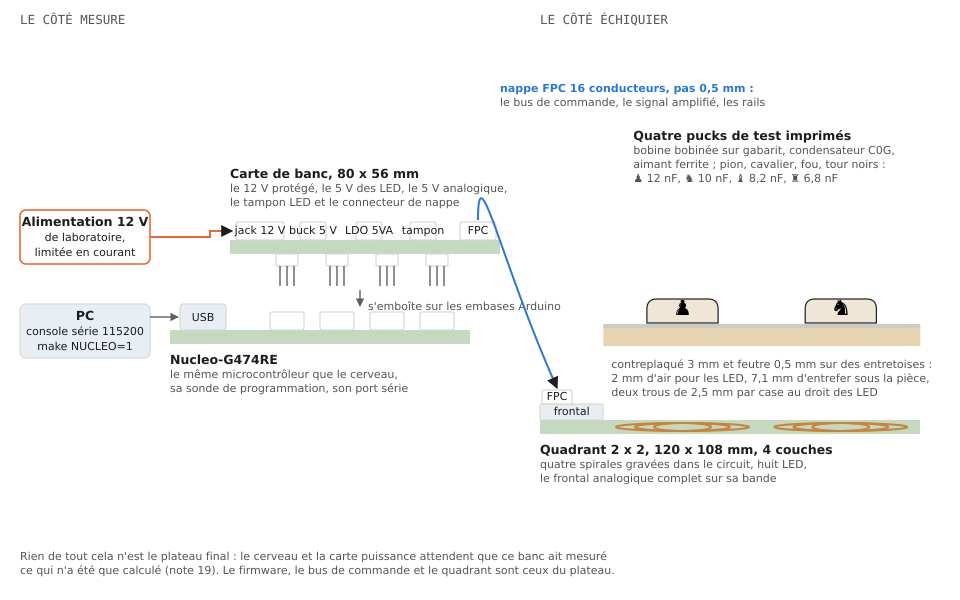
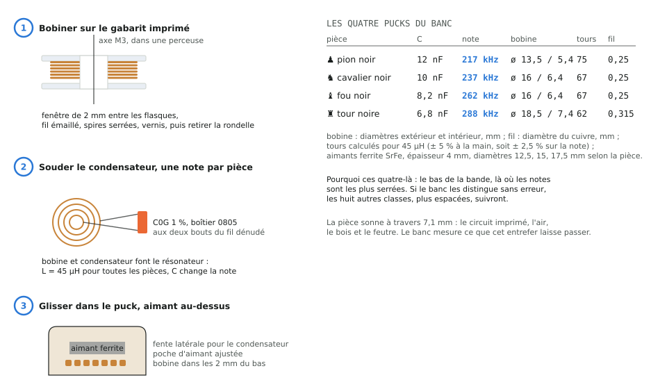
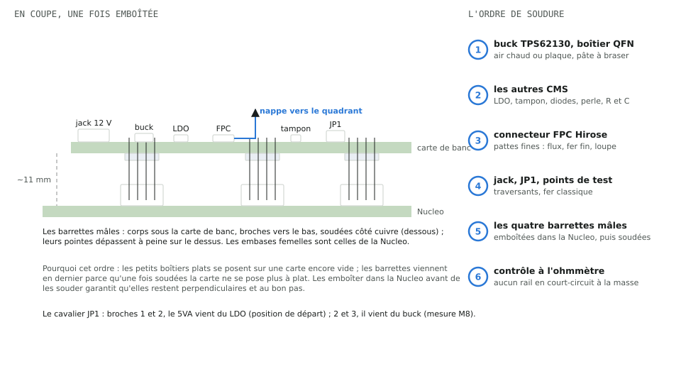
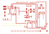
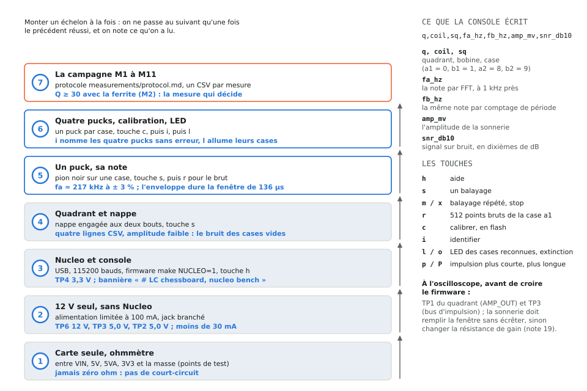

# 20. Le banc, du colis à la première mesure : le tuto

Suite des [notes 18](18-facteur-q.md) et [19](19-cerveau-et-banc-nucleo.md),
pour le même lecteur : quoi faire, quoi commander, quels composants,
comment les assembler et comment tester, pour passer du dépôt à un
banc qui mesure. Les chiffres viennent de `config/board.yaml` par
`chessboard_calc` ; les schémas sont produits par
`python -m docfig build` ; les nomenclatures sont celles écrites par
les générateurs dans `hardware/bench/` et `hardware/quadrant-2x2/`. Le
même tuto existe en page autonome, schémas et nomenclatures embarqués :
[`docs/pages/tuto-banc.html`](../pages/tuto-banc.html).

À retenir :

- Le banc, c'est quatre objets : une carte de développement Nucleo du
  commerce, une petite carte de banc qui s'emboîte dessus, un quadrant
  de quatre cases relié par une nappe, et quatre pucks de test. Plus
  du bois, du feutre et une alimentation 12 V.
- On ne commande rien tant que la section 1 n'est pas verte. Le
  18/09/2026 la carte de banc et le quadrant 2 x 2 sont tous deux au
  DRC zéro, éléments non connectés compris (117 le matin même) ; les
  composants passifs n'ont pas de code fournisseur.
- On monte le banc par échelons, un test par échelon, jamais deux
  nouveautés à la fois. La mesure qui décide de la suite du projet est
  M2 : le Q avec l'aimant ferrite doit rester au-dessus de 30.

## 1. Avant de commander : ce qui est prêt, ce qui ne l'est pas

| Élément | État au 18/09/2026 | Ce qui débloque |
|---|---|---|
| Carte de banc (`hardware/bench/`) | générée, 29 nets fermés, DRC KiCad 7 : zéro erreur, zéro élément non connecté ([README](../../hardware/bench/README.md)) | rien : gerbers commités, à déposer chez le fabricant (section 3.1) |
| Quadrant 2 x 2 (`hardware/quadrant-2x2/`) | reroutée le 18/09/2026 sur la comptabilité de connexité partagée ([note 04](04-routeur-et-garanties.md)) : bus réespacés pour qu'un via puisse les atteindre, plan de masse à la place du bus de masse, prises des cellules, sorties de la chaîne LED et les sept liaisons hors de portée du routeur dessinées dans le générateur. DRC KiCad 7 : zéro erreur, zéro élément non connecté, contre 117 le matin même, et le compte du build dit la même chose que celui de KiCad ([README](../../hardware/quadrant-2x2/README.md)) | rien : gerbers commités, à déposer chez le fabricant (section 3.1) |
| Codes fournisseur (LCSC) | présents pour les circuits intégrés, transistors, diodes, connecteurs, LED et inductance ; absents pour résistances, condensateurs, fusibles, barrettes, cavalier et points de test | une session avec accès au réseau (lot sourcing, [note 15](15-skills-embarques.md)) ; en attendant, les passifs se commandent par valeur et boîtier (section 3) |
| Devis de fabrication | à faire ([note 16](16-cout-des-cartes.md) pour les options) | même session réseau |
| Deux points de fiche technique | l'aiguilleur ADG1607 alimenté en 5 V, les vias de 0,45 mm chez le fabricant ([note 14](14-revue-des-cartes.md)) | lecture des fiches, devis |

Pour vérifier soi-même l'état d'une carte, avec le Python de KiCad
(runbook, [note 08](08-regenerer.md)) :

```bash
/usr/bin/python3 tools/drc.py hardware/bench/bench.kicad_pcb hardware/quadrant-2x2/quadrant-2x2.kicad_pcb
```

Le compte « unconnected items » doit être à zéro sur les deux cartes
avant toute commande. Le reste de cette note est écrit pour le moment
où ce sera le cas ; tout ce qui concerne la carte de banc, la Nucleo,
les pucks et le bois peut se préparer dès maintenant.

## 2. Ce qu'on construit



Le côté mesure est une Nucleo-G474RE, la carte de développement de ST
qui porte le même microcontrôleur que le cerveau du plateau, sa sonde
de programmation et son port série. La carte de banc s'emboîte dessus
comme un shield Arduino et lui apporte ce que le cerveau aurait donné
au quadrant : un 12 V protégé pour frapper les bobines, un 5 V pour
les LED, un 5 V analogique propre pour le frontal, un tampon pour la
chaîne LED, et le connecteur de nappe.

Le côté échiquier est le quadrant réduit 2 x 2 : quatre spirales
gravées dans le circuit imprimé, huit LED de camp et le frontal
analogique complet sur sa bande, le même circuit que les quadrants du
plateau. Une nappe FPC de seize conducteurs relie les deux côtés. Par
dessus le quadrant, le contreplaqué et le feutre reconstituent
l'entrefer réel de 7,1 mm ; les quatre pucks de test jouent les
pièces.

Pourquoi ce détour par un banc plutôt que le plateau tout de suite :
la [note 19](19-cerveau-et-banc-nucleo.md), section 4.

## 3. Quoi commander

### 3.1 Les deux circuits imprimés

| Carte | Format | Couches | Épaisseur | Particularités |
|---|---|---|---|---|
| Carte de banc | 80 x 56 mm | 2 | 1,6 mm | rien de spécial ; finition HASL sans plomb ou ENIG |
| Quadrant 2 x 2 | 120 x 108 mm | 4 | 1,6 mm | vias de 0,45 mm à perçage 0,2 mm sous les boîtiers fins : cocher l'option de perçage minimal 0,2 mm, à confirmer sur le devis ; un pochoir (stencil) rend la pose du frontal beaucoup plus sûre |

Cinq exemplaires sont le minimum chez JLCPCB et suffisent largement.
Le dépôt versionne les gerbers des deux cartes, il n'y a rien à
produire : `hardware/bench/bench-gerbers.zip` et
`hardware/quadrant-2x2/quadrant-2x2-gerbers.zip` se déposent tels
quels sur le site du fabricant. Ils sortent de `tools/gerbers.py`
(section « Gerbers » de la [note 08](08-regenerer.md)), qui remplit
les pours avant de tracer : un plan de masse exporté sans ce
remplissage arrive vide chez le fabricant. Les fichiers `jlc-bom.csv`
et `jlc-cpl.csv` de chaque carte servent si l'on choisit l'assemblage
en usine des composants qui ont un code (section 3.2 et 3.3) ; les
autres se soudent à la main.

### 3.2 Les composants de la carte de banc

Nomenclature `hardware/bench/bom.csv`, 43 composants. Les codes LCSC
sont ceux du générateur ; les lignes sans code se commandent par
valeur et boîtier.

| Repères | Quantité | Valeur | Boîtier | Référence, code LCSC |
|---|---|---|---|---|
| U1 | 1 | buck 5 V TPS62130 | QFN-16 3 x 3 mm | TPS62130RGTR, C74016 |
| U2 | 1 | LDO 5 V LP2985-5.0 | SOT-23-5 | LP2985AIM5-5.0, C129541 |
| U3 | 1 | tampon 74AHCT1G125 | SOT-23-5 | SN74AHCT1G125DBVR, C350557 |
| L1 | 1 | 2,2 µH | Bourns SRN6045 | SRN6045TA-2R2M, C167219 |
| D1 | 1 | SS34 (inversion) | SMA | C8678 |
| D2 | 1 | SMBJ15A (surtension) | SMB | C113962 |
| FB1 | 1 | perle BLM21PG221 | 0805 | BLM21PG221SN1D, C18305 |
| J1 | 1 | jack 12 V 5,5 x 2,1 mm | traversant | DC-005, C381118 |
| J2 | 1 | connecteur FPC 16 broches 0,5 mm | CMS | Hirose FH12-16S-0.5SH(55), C2837584 |
| F1, F2 | 2 | fusibles 1 A et 2 A | 1206 | par valeur |
| C1 | 1 | 100 µF 25 V électrolytique | 6,3 x 7,7 mm | par valeur |
| C7 | 1 | 100 µF 10 V électrolytique | 6,3 x 7,7 mm | par valeur |
| C2 | 1 | 10 µF 25 V | 1206 | par valeur |
| C5, C6 | 2 | 22 µF 10 V | 1206 | par valeur |
| C10 | 1 | 10 µF 10 V | 1206 | par valeur |
| C3, C11, C12, C14 | 4 | 100 nF | 0603 | par valeur |
| C4 | 1 | 3,3 nF | 0603 | par valeur |
| C8 | 1 | 10 nF | 0603 | par valeur |
| C9 | 1 | 2,2 µF | 0603 | par valeur |
| C13 | 1 | 1 nF | 0603 | par valeur |
| R1, R2, R4 | 3 | 100 kΩ | 0603 | par valeur |
| R3 | 1 | 523 kΩ 1 % | 0603 | par valeur |
| R5 | 1 | 470 Ω | 0603 | par valeur |
| R6 | 1 | 49,9 Ω 1 % | 0603 | par valeur |
| J3 à J6 | 4 | barrettes mâles 2,54 mm, 8, 6, 8 et 10 broches | traversant | par valeur (une barrette sécable de 40) |
| JP1 | 1 | barrette mâle 3 broches et un cavalier | traversant | par valeur |
| TP1 à TP7 | 7 | points de test | pastilles nues | rien à acheter |

Prendre deux exemplaires de chaque petit CMS : un 0603 qui saute de la
pince ne se retrouve pas.

### 3.3 Les composants du quadrant 2 x 2

Nomenclature `hardware/quadrant-2x2/bom.csv`, 44 lignes ; la fonction
de chaque bloc est dans la [note 17](17-quadrant-fonction-et-cablage.md).

| Repères | Quantité | Valeur | Boîtier | Référence, code LCSC |
|---|---|---|---|---|
| U3 | 1 | aiguilleur ADG1607 | LFCSP-32 5 x 5 mm, pas 0,5, pad thermique | ADG1607BCPZ, code à trouver |
| U5 | 1 | amplificateur d'instrumentation AD8421 | SOIC-8 | AD8421ARZ, C462186 |
| U7, U8 | 2 | double ampli op OPA2810 | SOIC-8 | OPA2810IDR, C2059830 |
| U1 | 1 | décodeur 74HC4514 | TSSOP-24 | 74HC4514PW, C5615 |
| U2 | 1 | décodeur 74HC154 | TSSOP-24 | 74HC154PW, C5613 |
| U6 | 1 | inverseur 74LVC1G04 | SOT-23-5 | SN74LVC1G04DBVR, C7477 |
| Q1, Q112, Q122, Q132, Q142 | 5 | P-FET AO3401A | SOT-23 | C15127 |
| Q2, Q111, Q121, Q131, Q141 | 5 | N-FET AO3400A | SOT-23 | C20917 |
| D113, D115, D123, D125, D133, D135, D143, D145 | 8 | B5819W | SOD-123 | C8598 |
| D114, D124, D134, D144 | 4 | SS34FL | SOD-123F | C2480216 |
| D111, D112, D121, D122, D131, D132, D141, D142 | 8 | BAV99W (écrêtage) | SOT-323 | code à trouver |
| D3 | 1 | BAV99 | SOT-23 | C2500 |
| LD1 à LD8 | 8 | LED WS2812B | 5050 | C2761795 |
| J1 | 1 | connecteur FPC 16 broches 0,5 mm | CMS | FH12-16S-0.5SH(55), C2837584 |
| C3 à C7, C14 à C16, C21, C22, CL1 à CL8 | 18 | 100 nF | 0603 | par valeur |
| C17, C18, C24 | 3 | 1 nF | 0603 | par valeur |
| C19, C20 | 2 | 330 pF | 0603 | par valeur |
| C13, C23 | 2 | 1 µF | 0603 | par valeur |
| C1 | 1 | 10 µF 25 V | 1206 | par valeur |
| C2 | 1 | 10 µF 10 V | 1206 | par valeur |
| R111, R112, R121, R122, R131, R132, R141, R142, R6 | 9 | 10 kΩ | 0603 | par valeur |
| R113, R114, R123, R124, R133, R134, R143, R144 | 8 | 330 Ω | 0603 | par valeur |
| R115, R125, R135, R145 | 4 | 100 kΩ | 0402 | par valeur |
| R116, R126, R136, R146 | 4 | 680 Ω | 0805 | par valeur |
| R8, R10, R12, R13 | 4 | 100 kΩ | 0603 | par valeur |
| R18, R22, R24 | 3 | 1 kΩ | 0603 | par valeur |
| R15, R16 | 2 | 787 Ω 1 % | 0603 | par valeur |
| R17, R21 | 2 | 590 Ω 1 % | 0603 | par valeur |
| R19, R20 | 2 | 750 Ω 1 % | 0603 | par valeur |
| R14 | 1 | 523 Ω 1 % (gain de l'AD8421) | 0603 | par valeur ; en prendre aussi 1 kΩ et 2 kΩ pour baisser le gain si la chaîne écrête |
| R23 | 1 | 3,57 kΩ 1 % | 0603 | par valeur |
| R25 | 1 | 49,9 Ω 1 % | 0603 | par valeur |
| R5 | 1 | 20,5 kΩ 1 % | 0603 | par valeur |
| R7 | 1 | 470 Ω | 0603 | par valeur |
| R9 | 1 | 10 Ω | 2010 | par valeur |
| TP1 à TP4 | 4 | points de test | pastilles nues | rien à acheter |
| NT1 à NT4 | 4 | les spirales : gravées dans le circuit | | rien à acheter |

### 3.4 La Nucleo, les câbles, l'alimentation

- **NUCLEO-G474RE** de ST, avec sa sonde ST-Link intégrée ; un câble
  USB micro-B vers le PC : il programme la carte et porte la console
  série.
- **Nappe FFC/FPC** de 16 conducteurs au pas de 0,5 mm, 100 à 150 mm,
  contacts du même côté aux deux bouts (dite « type A ») : les deux
  connecteurs sont identiques, montés côté composants, contacts vers
  le bas ; posée à plat entre les deux cartes, la nappe présente ses
  contacts vers le bas aux deux extrémités. En prendre deux.
- **Alimentation 12 V** de laboratoire, limitée en courant (100 mA
  suffisent au banc à vide, 500 mA avec les LED allumées), linéaire ou
  batterie : jamais un chargeur à découpage près des bobines
  ([note 10](10-plateau-8x8-et-horloge.md), section 12). Un cordon à
  fiche 5,5 x 2,1 mm, positif au centre.

### 3.5 De quoi faire les quatre pucks



- **Fil émaillé** de 0,25 mm (pion, cavalier, fou) et 0,315 mm (tour)
  de diamètre de cuivre ; compter 4 m par bobine, une bobine de 10 m
  de chaque diamètre laisse de quoi recommencer.
- **Condensateurs C0G 1 %**, boîtier 0805, 50 V : 12 nF, 10 nF,
  8,2 nF et 6,8 nF, un de chaque plus rechange. C0G est le
  diélectrique qui ne bouge ni avec la température ni avec le temps :
  c'est lui qui tient la note.
- **Aimants ferrite** (SrFe, hard ferrite), épaisseur 4 mm, diamètres
  12,5, 15 et 17,5 mm selon la pièce (table de la figure) ; au
  diamètre du commerce le plus proche, la poche du puck se règle dans
  `mechanical/`. Pas de néodyme dans les pucks : la [note 18](18-facteur-q.md)
  explique pourquoi, et M3 le mesure.
- **Impression 3D** : les quatre pucks `puck-<classe>-black`, les
  trois gabarits de bobinage `jig-core-d*` et leurs rondelles
  `jig-washer-d*`, produits par `python mechanical/build_all.py`
  ([README](../../mechanical/README.md)). Vis M3 x 30 avec deux
  écrous pour l'axe du gabarit, vernis ou colle cyanoacrylate.

### 3.6 Le bois et la quincaillerie

- Contreplaqué sec de 3 mm et feutre autocollant de 0,5 mm, environ
  130 x 130 mm pour couvrir les quatre cases (l'entrefer de 7,1 mm se
  décompose en 1,6 mm de circuit, 2 mm d'air, 3 mm de bois, 0,5 mm de
  feutre : tout est dans `gap` du yaml).
- Entretoises nylon M3 : 2 mm entre la carte et le bois (l'air des
  LED), 10 mm sous la carte ; le gabarit de perçage
  `surface-template` de `mechanical/exports/` donne les trous de
  fixation et les deux points lumineux de 2,5 mm par case.
- **Vis et écrous M3 en nylon**, pas en acier, et des rondelles avec
  eux. Le cuivre s'approche à 2,15 mm de l'axe des trous du quadrant,
  soit un anneau libre de 0,55 mm seulement, là où une tête de vis M3
  fait 5,5 à 6 mm : une vis métallique se poserait sur du cuivre sous
  un vernis de 20 µm. C'est la décision prise sur le premier des deux
  points de la [note 21](21-routage-et-regles-de-l-art.md), et elle ne
  coûte rien à la carte.

### 3.7 Déposer la commande chez le fabricant

Trois choses surprennent à la première commande, et les trois sont
normales :

- **Le fabricant ne retrouve pas tous les composants.** Sa bibliothèque
  d'assemblage n'est pas tout le catalogue du distributeur, et les
  stocks bougent : un code valide peut être introuvable ou épuisé le
  jour de la commande. Les pièces concernées apparaissent en
  « unselected parts ». Trois sorties, dans cet ordre : chercher le
  même boîtier chez le fabricant et remplacer le code dans
  `jlc-bom.csv` ; retirer la ligne et souder la pièce à la main (tous
  les boîtiers de ce projet se soudent au fer sauf le buck QFN de la
  carte de banc et l'aiguilleur LFCSP du quadrant) ; ou ne commander
  que les circuits nus. Les amplificateurs OPA2810 et AD8421 sont les
  plus exposés : ils sont aussi dans la nomenclature du quadrant, donc
  le contrôle vaut pour les deux cartes.
- **Les composants semblent mal alignés sur l'aperçu.** Le fichier de
  placement que les générateurs écrivent utilise le repère du
  fabricant, origine au coin bas gauche et ordonnée retournée par
  rapport à KiCad ; les positions sont donc justes. Ce qui diffère,
  ce sont les rotations : le fabricant oriente certains boîtiers
  autrement que KiCad (SOT-23 à 180 degrés, SOIC à 90 ou 270, QFN à
  90, diodes SMA et SMB à 180). Son aperçu permet de corriger pièce
  par pièce avant de payer ; noter les corrections retenues et les
  redescendre dans le générateur, qui les appliquera aux exports
  suivants.
- **Une carte n'a pas de fichiers d'assemblage.** C'est qu'aucune de
  ses pièces n'a encore de code fournisseur. La carte bobines en a
  depuis le 19/09/2026 : ses huit LED de camp sont dans
  `jlc-bom.csv`, leurs huit découplages restent à poser à la main.

### 3.8 L'outillage

| Outil | Pour quoi | Indispensable |
|---|---|---|
| fer à souder à pointe fine, flux, tresse à dessouder, loupe ou binoculaire | tout le CMS courant, le connecteur FPC | oui |
| station à air chaud ou plaque chauffante, pâte à braser, pochoir | le buck QFN de la carte de banc, l'aiguilleur LFCSP du quadrant (pad thermique sous le boîtier, impossible au fer) | oui pour ces deux boîtiers |
| multimètre | continuité, tensions des points de test | oui |
| alimentation 12 V limitée en courant | section 3.4 | oui |
| oscilloscope, 5 MHz de bande et 10 Méch/s au minimum | voir le signal avant de croire le firmware | oui pour les mesures, pas pour les premiers échelons |
| LCR-mètre | L et Q des bobines nues | conseillé |
| perceuse ou petit tour | bobiner | oui |
| imprimante 3D, ou un service d'impression | pucks et gabarits | oui |
| analyseur logique | le bus de commande, en cas de doute | non |

Ce qu'on demande à l'oscilloscope vient de la bande de mesure, 217 à
613 kHz (`resonance.frequency_plan`). La note la plus haute fixe les
deux planchers : huit fois cette note en bande passante pour que la
sonnerie ne soit pas arrondie, soit 4,9 MHz, et dix échantillons par
période, soit 6,1 Méch/s. Il faut aussi tenir à l'écran la fenêtre
d'écoute, 136 µs sur le banc (512 points à 3,78 Méch/s). Les
amplitudes sont généreuses : la force électromotrice sur la spirale va
de 0,12 à
0,74 V crête selon la pièce, une fois les 2 µs de silence passés
(`coupling.ringdown_signal`), et AMP_OUT se lit autour de 1,65 V. Un
petit appareil de poche à une voie, 10 MHz de bande et 48 Méch/s,
couvre donc tout ce que les échelons demandent, avec 78 échantillons
par période sur la note la plus haute.

Deux limites à connaître avant de s'y fier. Une seule voie interdit de
voir l'impulsion et la sonnerie ensemble : on déclenche alors sur la
sonnerie elle même (mode normal ou coup unique, front montant, seuil
au dessus du bruit) et on vérifie l'impulsion dans un second temps,
sonde sur TP3. Et une bande de 10 MHz ne dit rien de l'ondulation du
buck à 2,2 MHz : cette comparaison (mesure M8) se lit de toute façon
dans les relevés bruts du firmware, pas à l'écran. De même, le
générateur intégré de ces appareils plafonne vers 50 kHz, quatre fois
sous notre bande : il n'excite rien ici, l'excitation c'est
l'impulsion de la carte.

L'oscilloscope ne mesure pas les notes, il montre qu'elles existent.
L'identification demande environ 1 kHz de résolution devant un écart
pire cas de 7,06 kHz entre deux pièces voisines
(`resonance.check_separation`) : c'est le firmware qui la fournit,
512 points à 3,78 Méch/s, FFT et interpolation parabolique, seize
moyennes cohérentes. Lire une période au curseur sur un écran de
320 pixels donne quelques milliers de hertz d'erreur, bon pour
diagnostiquer, insuffisant pour nommer une pièce. Le Q, lui, se lit
très bien à l'écran : l'enveloppe décroît en 16 à 73 µs selon la note
et le Q (`ringdown_tau_us`), soit une dizaine de périodes bien
visibles avant l'extinction.

## 4. Assembler

### 4.1 Le quadrant 2 x 2

Rien à bobiner : les spirales sont dans le circuit imprimé. Tout se
joue sur la bande de frontal, 20 mm de large, et dans les coins des
cases pour les LED. L'ordre :

1. L'aiguilleur U3 (LFCSP, pad thermique) : pâte à braser au pochoir
   ou à la seringue, plaque chauffante ou air chaud, repère de la
   broche 1 sur la sérigraphie. Vérifier à la loupe qu'aucune broche
   n'est pontée.
2. Les décodeurs TSSOP U1 et U2, l'AD8421 et les deux OPA2810 en
   SOIC, l'inverseur : fer fin, une broche d'ancrage puis les autres,
   tresse en cas de pont.
3. Les transistors et les diodes : la bague de cathode des diodes en
   face du trait de la sérigraphie ; les BAV99W (SOT-323) sont les
   plus petits boîtiers de la carte.
4. Les résistances et condensateurs, par valeur, en cochant la
   nomenclature au fur et à mesure.
5. Les huit WS2812B en dernier, à température modérée (elles
   supportent mal la chaleur), avec leurs 100 nF ; respecter le coin
   biseauté du boîtier.
6. Le connecteur FPC : les pattes de 0,5 mm se soudent avec beaucoup
   de flux, en glissant la pointe le long de la rangée ; contrôler
   les ponts à la loupe. Le volet du connecteur s'ouvre vers le haut,
   la nappe se glisse contacts vers le bas, le volet se referme.
7. Nettoyer le flux à l'alcool isopropylique : le frontal traite des
   microvolts, les résidus font des fuites.

### 4.2 La carte de banc



L'ordre est celui de la figure : le buck QFN d'abord, à l'air chaud
ou sur plaque, pendant que la carte est vide et à plat ; puis les
autres CMS au fer ; le connecteur FPC ; les traversants (jack,
cavalier JP1) ; et les quatre barrettes mâles en dernier, parce
qu'une fois soudées la carte ne se pose plus à plat.

Pour situer chaque repère de la nomenclature 3.2 au moment de
souder, la face composants tracée par KiCad, pours remplis (les
sérigraphies portent les repères ; la face masse est dans le
[README](../../hardware/bench/README.md) de la carte) :



Les barrettes sont la seule chose à ne pas se tromper : le corps
sous la carte, les broches vers le bas, la soudure sur le dessous
(le côté cuivre). Pour qu'elles restent perpendiculaires et au bon
pas, les emboîter d'abord dans les embases femelles de la Nucleo,
poser la carte de banc dessus, et souder les broches par le dessus
de la carte (les pointes dépassent à peine) ; ensuite seulement
retirer l'ensemble de la Nucleo. Les quatre embases de la Nucleo ne
sont pas symétriques (8, 6, 8 et 10 broches) : la carte ne s'emboîte
que dans un sens.

Le cavalier JP1 choisit d'où vient le 5 V analogique : broches 1 et 2,
du LDO, la position de départ ; 2 et 3, du buck, pour la comparaison
de la mesure M8.

### 4.3 Les pucks

Un puck est un résonateur : une bobine et un condensateur qui sonnent
à une note, plus un aimant ferrite pour que, plus tard, le chariot du
plateau puisse déplacer la pièce. La [note 18](18-facteur-q.md) dit
ce que Q mesure et pourquoi la ferrite plutôt que le néodyme.

1. Imprimer le gabarit du bon diamètre (un par classe de bobine : la
   figure donne les diamètres) et ses rondelles.
2. Monter le noyau sur une vis M3 dans le mandrin d'une perceuse,
   rondelle serrée ; passer le bout du fil dans l'encoche en laissant
   10 cm libres.
3. Bobiner à vitesse lente le nombre de tours de la table (75, 67, 67
   ou 62 selon la pièce), spires serrées et régulières, dans la
   fenêtre de 2 mm ; laisser 10 cm en sortie.
4. Imprégner de vernis ou d'une goutte de cyanoacrylate, laisser
   sécher, retirer la rondelle et sortir la bobine.
5. Dénuder les deux bouts (l'émail part au grattoir ou dans une grosse
   goutte d'étain bien chaude), souder le condensateur C0G aux deux
   fils, court, dans le prolongement de la bobine.
6. Si un LCR-mètre est là : mesurer L, attendue à 45 µH à ± 5 %, et
   Q à 100 kHz ; noter les valeurs sur le puck, elles servent en M1 et
   M6.
7. Glisser la bobine dans les 2 mm du fond du puck, le condensateur
   dans sa fente, l'aimant dans sa poche par dessus ; un point de
   colle. Marquer le puck de sa classe (le glyphe de la pièce suffit).

Quatre bobines à la main donnent quatre inductances légèrement
différentes : c'est attendu, la note bouge de ± 2,5 % au plus, et la
calibration du firmware mesure chaque pièce avant de la reconnaître.

### 4.4 Le bois

Scotcher le gabarit `surface-template` sur le contreplaqué, percer les
trous de fixation et les points lumineux de 2,5 mm au droit des LED,
coller le feutre, poser sur les entretoises de 2 mm au-dessus du
quadrant. Ne rien mettre de métallique entre la carte et les pucks :
une vis en acier au milieu d'une case change sa note.

## 5. Tester



La règle : monter un échelon à la fois, noter ce qu'on a lu, et ne
passer au suivant qu'une fois le précédent réussi. Les tensions
attendues se lisent sur les points de test de la carte de banc :
TP6 VIN, TP3 5V, TP2 5VA, TP4 3V3, TP5 GND, TP7 ADC1, TP1 LED_END.

1. **Carte de banc seule, ohmmètre.** Entre chaque rail (VIN, 5V, 5VA,
   3V3) et la masse : jamais zéro ohm. Une valeur qui monte lentement
   (les condensateurs qui se chargent) est normale.
2. **12 V seul, sans Nucleo.** Alimentation limitée à 100 mA, jack
   branché : TP6 à 12 V, TP3 à 5,0 V (le buck), TP2 à 5,0 V (le LDO,
   cavalier en 1-2), consommation de quelques milliampères. Si le
   courant part en butée, couper : chercher un pont de soudure sur le
   buck ou une diode à l'envers.
3. **Nucleo et console.** Compiler et flasher le firmware du banc :

   ```bash
   cd firmware/board
   make NUCLEO=1            # build/nucleo/board-nucleo.bin
   make NUCLEO=1 flash      # rappelle la commande st-flash ; ou copier le .bin sur le lecteur NUCLEO
   ```

   Ouvrir le port série de la sonde à 115200 bauds (par exemple
   `screen /dev/ttyACM0 115200`). Emboîter la carte de banc, brancher
   le 12 V : TP4 à 3,3 V (le 3,3 V vient de la Nucleo), et la console
   affiche la bannière `# LC chessboard, nucleo bench` avec la
   cadence d'échantillonnage et l'en-tête du CSV. La touche `h` liste
   les commandes.
4. **Quadrant et nappe.** Nappe engagée aux deux bouts, 12 V
   rebranché : `s` écrit quatre lignes CSV (cases 0, 1, 8, 9, soit a1,
   b1, a2, b2) avec une note quelconque et une amplitude faible :
   c'est le bruit, il n'y a pas de pièce. Les LED attendent l'échelon
   6 : `l` n'allume que les cases reconnues, et répond
   `# no calibration stored` tant que `c` n'a pas tourné.
5. **Un puck, sa note.** Le pion noir sur une case : `s` doit donner
   sur cette case `fa_hz` proche de 217 000 (± 3 %, la tolérance du
   fil et du condensateur), `fb_hz` à quelques centaines de hertz de
   `fa_hz`, une amplitude nettement au-dessus des cases vides. La
   touche `r` vide les 512 points bruts de la case a1 : tracés, ils
   doivent montrer une sinusoïde qui décroît doucement sur toute la
   fenêtre de 136 µs. Si elle est plate en haut, la chaîne écrête :
   remplacer R14 du quadrant par une valeur plus forte (gain plus
   faible).
6. **Quatre pucks, calibration, LED.** Un puck par case, `c` mesure
   et range les quatre notes en flash, `i` les reconnaît ensuite ;
   permuter deux pucks et refaire `i` : les noms doivent suivre. `l`
   allume alors les quatre cases, en blanc chaud ou en bleu selon la
   classe, et `o` les éteint : c'est le test de la chaîne LED. Les
   quatre notes attendues : 217, 237, 262 et 288 kHz.
7. **La campagne M1 à M11.** Le protocole
   [`measurements/protocol.md`](../../measurements/protocol.md) dit,
   pour chaque mesure, la préparation, la commande, le fichier CSV à
   remplir et le critère ; la [note 19](19-cerveau-et-banc-nucleo.md),
   sections 6 et 7, donne la valeur théorique de chaque grandeur et
   l'ordre : d'abord AMP_OUT à vide à l'oscilloscope (TP1 du
   quadrant), puis un puck sans aimant (M1), puis avec la ferrite
   (M2, la mesure qui décide), puis les quatre pucks, les voies A et B,
   les LED et le bois.

Avant de croire le firmware, l'oscilloscope : sonde sur TP1 du
quadrant (AMP_OUT, centré sur 1,65 V) et sur TP3 (le bus d'impulsion),
déclenchement sur TP3. On doit voir l'impulsion de 1 µs, 2 µs de
silence, puis la sonnerie qui remplit la fenêtre sans toucher les
rails.

## 6. Si ça ne marche pas

| Symptôme | Où regarder |
|---|---|
| Pas de console | le port série est celui de la sonde ST-Link (ttyACM sous Linux, COM sous Windows), 115200 bauds ; le firmware est bien celui de `build/nucleo/` |
| TP3 sans 5 V | polarité du jack (positif au centre), fusible F1, pont de soudure sur le buck, D1 à l'envers |
| TP2 sans 5 V | cavalier JP1 absent ou sur 2-3 sans buck ; LDO U2 |
| Console vivante, `s` sans amplitude même avec un puck | nappe mal engagée ou contacts du mauvais côté ; 5VA absent sur le quadrant (TP2) ; MUX_EN_L ou PULSE_EN : regarder TP3 du quadrant à l'oscilloscope pendant `s`, l'impulsion doit y être |
| Note très différente de celle attendue | mauvais condensateur ou nombre de tours ; un LCR-mètre tranche en une minute ; du métal près de la case |
| Q faible, sonnerie courte | métal à proximité, bobine mal vernie, ou un aimant néodyme à la place de la ferrite ; comparer avec et sans aimant (M1 contre M2) |
| Sonnerie écrêtée | gain trop fort pour l'entrefer réel : R14 du quadrant vers 1 kΩ ou 2 kΩ |
| LED muettes | `l` demande une calibration au préalable ; sinon TP1 LED_END de la carte de banc, tampon U3, 5V_LED et fusible F2 |

## 7. Lexique

- **Shield** : carte fille qui s'emboîte sur les connecteurs d'une
  carte de développement, au format des Arduino ici.
- **CMS** : composant monté en surface, sans pattes traversantes ; les
  tailles 0603, 0805, 1206 sont ses dimensions en centièmes de pouce.
- **QFN, LFCSP** : boîtiers plats sans broches apparentes, avec une
  plage de soudure sous le composant : air chaud ou plaque chauffante.
- **Nappe FPC** : câble plat souple à contacts imprimés, pas de
  0,5 mm entre conducteurs.
- **Gerber** : les fichiers de fabrication d'un circuit imprimé, une
  couche par fichier.
- **C0G** : diélectrique de condensateur céramique stable en
  température et dans le temps.
- **Puck** : le palet de test qui tient lieu de pièce d'échecs.
- **Point de test** : une pastille nue sur la carte, faite pour y poser
  une sonde.
- **CSV** : le texte que la console écrit, une mesure par ligne, des
  virgules entre les colonnes ; les tableurs et les notebooks du
  dossier `measurements/` le lisent tel quel.
