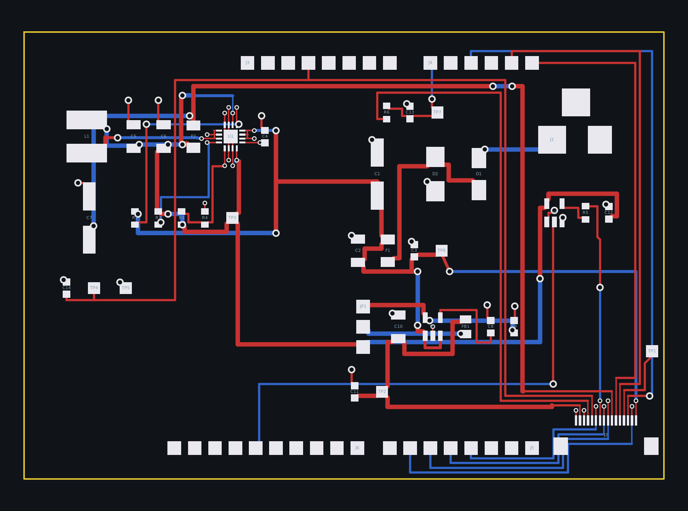
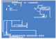

# Banc Nucleo : shield d'alimentation et de liaison du quadrant 2 x 2



Les deux faces tracées par KiCad, pours remplis (`tools/plot.py`) :
la face composants avec sa sérigraphie, puis la face masse vue
retournée, comme on regarde la carte réelle.




Carte générée par `tools/boardgen` (module `bench`) depuis la section
`bench` de `config/board.yaml`, pour le banc de la
[note 19](../../docs/notes/19-cerveau-et-banc-nucleo.md) : une
Nucleo-G474RE (le MCU du cerveau, sa sonde et son port série) qui
mesure le quadrant réduit 2 x 2 (`hardware/quadrant-2x2/`) avec le
firmware du cerveau compilé en `make NUCLEO=1`. Le shield apporte au
quadrant ce que le cerveau lui aurait donné, et rien d'autre.
80 x 56 mm, 2 couches : composants et signaux sur F.Cu, plan de masse
sur B.Cu. Elle s'emboîte sur les quatre embases Arduino de la Nucleo
par des barrettes mâles montées côté cuivre, corps sous la carte.

## Blocs

- **Embases Arduino** (J3 alimentation, J4 analogique, J5 numérique 0 à
  7, J6 numérique 8 à 15) : positions prises sur l'empreinte officielle
  `Arduino_UNO_R3`, contour Uno affleurant au bord ouest, bande de
  11,4 mm à l'est pour le jack et la nappe. Le bus du quadrant est sur
  les broches de `bench.signals` : AMP_OUT (après RC) sur A0, PULSE_EN
  sur A2, MUX_A0 à A2 sur D3, D4, D5, MUX_EN_L sur A5, MUX_EN_H sur A4,
  DAMP_EN_N sur D6, LED_DIN sur D13. Le shield prend le 3,3 V et la
  masse de la Nucleo ; son 5 V ne remonte jamais vers elle (la Nucleo
  reste sur l'USB de sa sonde), VIN, 5V, IOREF, NRST et AREF restent
  ouverts.
- **Entrée 12 V** (J1 jack 5,5 x 2,1 mm, prise vers l'est) : SS34 en
  série contre l'inversion, SMBJ15A vers la masse, fusible 1 A, puis
  100 µF, 10 µF et 100 nF : la réserve du rail d'impulsion, comme sur
  le cerveau, dans la colonne centrale entre le jack et le buck.
- **Buck 5 V** (TPS62130, 2,2 µH, DEF haut : PWM forcé) : le rail des
  LED à travers un second fusible 2 A et 100 µF, et l'alimentation du
  tampon LED. Colonne ouest, là où le motif Uno laisse le shield vide.
- **Îlot analogique 5VA** : LP2985-5.0 depuis le 12 V, perle de
  ferrite BLM21PG221, 10 µF et 100 nF, comme sur le cerveau. Le
  cavalier JP1 choisit la source de 5VA_RAW : broches 1 et 2, le LDO
  (défaut) ; 2 et 3, le buck. C'est la comparaison LDO contre buck de la
  mesure M8.
- **Liaison quadrant** : J2, FPC 16 broches Hirose FH12 au brochage du
  quadrant (`plateau.quadrant.link.pinout`), au coin sud-est, nappe
  vers le sud, pastilles vers le nord ; tampon 74AHCT1G125 (3,3 V vers
  5 V) et 470 ohms devant LED_DIN, LED_DOUT sur un point de test ;
  49,9 ohms et 1 nF devant A0, le filtre du cerveau.
- **Points de test** : TP1 LED_END (au coin sud-est, contre le
  connecteur FPC), TP2 5VA, TP3 5V, TP4 3V3, TP5 GND, TP6 VIN, TP7 ADC1
  (AMP_OUT filtré). Le bus de commande (PULSE_EN, DAMP_EN_N, adresses
  du mux) se sonde sur les broches Morpho de la Nucleo, qui doublent
  chaque broche Arduino.

## Ce qui se soude à la main

Le tampon LED, le buck, l'inductance, le LDO, la perle, les diodes,
le jack et le connecteur FPC reprennent les références du cerveau,
code LCSC compris. Les passifs, les quatre barrettes Arduino (côté
cuivre), JP1 et les points de test n'ont pas de code : `jlc-bom.csv`
ne liste que les lignes qui en ont un, le reste se soude à la main ou
attend la passe de sourcing des autres cartes.

## Régénérer

```bash
PYTHONPATH=tools .venv/bin/python -m boardgen build bench --render docs/images/bench.png
/usr/bin/python3 tools/plot.py hardware/bench/bench.kicad_pcb --out docs/images
```

La seconde commande, avec le Python de KiCad, remplit les pours et
trace les deux faces en SVG (`bench-top.svg`, `bench-bottom.svg`).

`tests/test_bench.py` vérifie que chaque signal du bus est sur la
broche du cerveau (sauf DAMP_EN_N, déplacé de PC2 à D6 parce que PC2
n'atteint qu'un connecteur Morpho), que chaque broche d'embase porte
le net que dit le yaml, que la nappe reprend le brochage du quadrant,
et que chaque broche de barrette tombe sur la pastille de l'empreinte
Uno qu'elle représente.

## Routes manuelles

Le routeur seul laissait six nets ouverts et, au DRC de KiCad, une
trentaine de connexions manquantes que son propre bilan ne voyait pas
(couloirs de sortie des vias d'éventail sans cuivre, pistes finissant
sur le coin arrondi d'une pastille, voir la
[note 04](../../docs/notes/04-routeur-et-garanties.md)). La carte se
finit donc comme dans pcbnew, mais dans le générateur, par des routes
manuelles (`hand_routes` de `tools/boardgen/bench.py`) que chaque
build redessine et vérifie :

- **Éventail du FPC** (J2, seize pastilles au pas de 0,5 mm) : pas de
  via d'éventail dans le plan de masse ; chaque broche quitte son
  moignon sur une colonne de 0,2 mm et tourne à sa hauteur dans une
  voie de 0,3 mm, vers l'ouest pour 5VA, AMP_OUT1, 3V3 et 5V_LED, vers
  l'est pour MUX_EN_L, MUX_EN_H, LED_END et PULSE_EN, la broche la
  plus extérieure d'abord, la suivante une voie plus haut, si bien
  qu'aucune voie ne croise une colonne ; les fins de voies sont
  décalées pour laisser un via au bout de chacune. MUX_A0, MUX_A1,
  MUX_A2 et DAMP_EN_N prennent un petit via aux rangées d'éventail et
  passent en face arrière sous le connecteur, puis sous l'embase J5
  jusqu'à leurs broches ; VIN et LED_DIN1 de même vers le nord. Les
  deux broches de masse tombent au plan par un via au bout de leur
  piste d'envol.
- **Bande est** : MUX_EN_L monte en face avant jusqu'à la rangée de J4
  et entre dans la dernière broche par le bout de la rangée, MUX_EN_H
  passe au-dessus de la rangée, PULSE_EN monte en face arrière le long
  du bord (les deux se croiseraient sinon), LED_END rejoint TP1.
- **Face nord** : 3V3 monte à l'ouest de C9, passe sous les embases
  jusqu'à J3, continue vers l'ouest et redescend entre C6 et R3 vers
  TP4 et C14 ; 5V_LED et AMP_OUT1 suivent, une voie plus bas chacune,
  jusqu'au fusible des LED et au filtre de l'ADC, 5V_LED sautant en
  face arrière sur deux millimètres pour franchir la montée de 3V3 ;
  VIN traverse la carte en face arrière à mi-hauteur jusqu'à TP6.
- **Buck** : une barrette de 0,2 mm sur les bouts de moignons relie
  les trois pastilles SW, une autre les trois VIN (le routeur posait
  une piste de puissance le long d'une piste d'envol, à 0,10 mm du
  moignon voisin) ; SW part en face arrière vers l'inductance, VIN vers
  un via à l'est de C4 puis le condensateur d'entrée, la pastille 5 V
  du côté nord suit son couloir de sortie ; les quatre pastilles de
  masse du QFN sont pontées à son pad thermique.
- **Masses murées** : la pastille de masse du LDO (entre ses deux
  VIN) et celle de R4 ont un moignon et un petit via vers le plan.

Chaque route manuelle est vérifiée au build par le contrôle
d'isolement exact contre le cuivre déjà posé ; le routeur part de ces
routes et termine chaque net. Un déplacement de composant qui les
rendrait fausses fait échouer le build.

## Résultat du build

Généré par `python -m boardgen build bench` :

| Composants | Segments | Vias | Nets fermés | Nets ouverts | Défauts d'isolement |
|---|---|---|---|---|---|
| 43 | 263 | 72 | 29 | 0 | 0 |

Tous les nets sont fermés : le contrôle de connexité partagé des
générateurs (`tools/quadgen/connect.py`, chaque net une seule pièce de
cuivre, plan de masse compris, [note 04](../../docs/notes/04-routeur-et-garanties.md))
ne signale rien, `tests/test_bench.py` le vérifie à chaque exécution.

DRC KiCad 7.0.11 (`/usr/bin/python3 tools/drc.py
hardware/bench/bench.kicad_pcb`, zones remplies) : zéro erreur, zéro
élément non connecté ; 83 avertissements, tous ignorables : 43
chemins de bibliothèque des empreintes (la configuration de KiCad ne
connaît pas les bibliothèques par leur nom), 35 de sérigraphie
(références sur une ligne ou une pastille), 5 vias d'éventail du QFN
raccordés d'un seul côté (la route est partie en face avant).

## Gerbers de fabrication

`bench-gerbers.zip` se dépose tel quel chez le fabricant : 2 couches
(F.Cu, B.Cu), la pâte de la face composants, les deux sérigraphies,
les deux masques, le contour et les perçages Excellon séparés (PTH et
NPTH), plus le fichier de tâche `.gbrjob`. 1,6 mm, finition HASL sans
plomb ou ENIG ; les options de commande et la nomenclature sont dans
la [note 20](../../docs/notes/20-tuto-banc.md), section 3.

```bash
/usr/bin/python3 tools/gerbers.py hardware/bench/bench.kicad_pcb
```

Avec le Python de KiCad : l'outil remplit les pours d'une copie de la
carte avant de tracer (sans ce remplissage le plan de masse de B.Cu
sort vide), lit le jeu de couches sur la carte, et refuse d'exporter
tant qu'une pastille reste non connectée. Le dossier `gerbers/` qu'il
écrit n'est pas versionné ; l'archive l'est.
