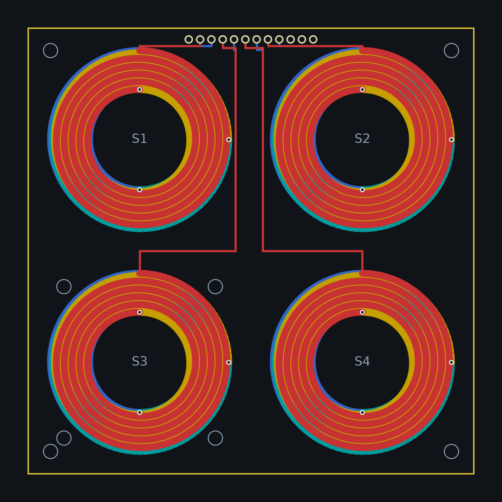

# Carte bobines du pilote 2 x 2



Carte 100 x 100 mm, 4 couches, entièrement générée par
`python -m coilgen build` depuis `config/board.yaml` (section
`mockup.coil_board`). Ne pas éditer le `.kicad_pcb` à la main : modifier
le yaml ou le générateur, puis regénérer.

Depuis le 07/10/2026 c'est la carte du **pilote simple** : une seule
carte à concevoir, passive, dans le palier tarifaire 100 x 100 mm, dont
le frontal analogique vit sur un shield à côté de la Nucleo-G474RE. Ce
que le pilote réunit et ce qu'il coûte est dans la
[fiche du pilote](../../../docs/bom-pilote.md).

## Contenu

- 4 spirales de détection (S1 à S4 au pas de 50 mm) : 5 tours par
  couche, 4 couches en série, piste 1,60 mm, espace 0,15 mm, environ
  16 µH par bobine, bornes empilées verticalement et routées en paire
  vers le connecteur.
- Connecteur J1, barrette 1 x 12 au pas 2,54 (ordre des broches : GND,
  C1A, C1B, C3A, C3B, C4A, C4B, C2A, C2B, GND, DIN, 5V), le brochage
  qu'attend la carte analogique (`analoggen`). Les broches 11 et 12
  (DIN, 5V) ne portent aucun cuivre sur la carte passive.
- 4 trous de fixation M3 aux coins (entretoises de 25 mm pour arriver
  au niveau du shield Nucleo).
- 4 trous M3 espacés de 34 mm autour de S3 pour le support d'aimant
  réglable imprimé (répertoire `mechanical/`).
- **Aucun composant** : `mockup.coil_board.leds.fitted` vaut `false`
  dans le yaml. Le mettre à `true` remet les huit WS2812B de camp et
  leurs huit 100 nF de l'ADR 0009, avec leur chaîne de données, leur
  5 V et leur masse ; cette variante éclairée n'a pas été reprise au DRC
  (elle portait 251 violations et deux liaisons ouvertes, voir la
  [note 22](../../../docs/notes/22-erreurs-de-conception.md), points 10
  et 12) et ne se commande pas en l'état.

## Nomenclatures et placement

`python -m coilgen build` écrit, à côté de la carte, `bom.csv`,
`jlc-bom.csv` et `jlc-cpl.csv`. Sur la carte passive ils n'ont que
leur ligne d'en-tête : rien à assembler, rien à placer. La seule pièce
à acheter à part est la barrette mâle 1 x 12 au pas 2,54 (droite, ou
coudée si le shield est coplanaire), à souder à la main, 0,1 USD.

## Ouvrir

`coil-board.kicad_pro`, généré avec la carte, est le fichier à ouvrir
dans KiCad ; il porte la classe de nets et les minima du DRC issus du
yaml : garde 0,13 mm, piste d'interconnexion 0,5 mm, vias 0,6/0,3 mm
pour les bobines, cuivre à 0,5 mm du bord. La carte n'a pas de
schéma : elle est purement passive et toute sa connectivité tient dans
le `.kicad_pcb`.

## Fabrication : commandable (07/10/2026)

```bash
sh hardware/mockup-2x2/coil-board/export.sh
```

Le script regénère la carte puis appelle `tools/gerbers.py`, comme les
autres cartes du dépôt : les plans sont remplis avant le tracé, la pile
de couches est lue sur la carte, et l'export est refusé tant que le
routage n'est pas fermé.

État mesuré par `tools/drc.py` (KiCad 7.0.11) sur le fichier commité :

| Contrôle | Résultat |
|---|---|
| Erreurs de DRC | **0** (gardes, perçages, masque, bord) |
| Éléments non connectés | **0** (7 587 pistes, 12 vias) |
| Avertissements, ignorés par le garde | 9 `lib_footprint_issues` (empreintes embarquées, pas de bibliothèque), 1 copeau de cuivre sur B.Cu sans position, sans effet en fabrication |

Ce qui a fermé la carte, par rapport à son état du 19/09/2026
(251 violations, deux liaisons ouvertes) :

- les LED et leur routage sont coupés par le yaml : tous les perçages
  superposés, toutes les gardes de perçage et presque tous les ponts de
  masque venaient de la chaîne de LED ;
- la bande de masse qui relie les deux broches GND du connecteur passait
  sur les pastilles des broches 2 à 9 (seize défauts) : elle court
  maintenant à 0,6 mm du bord, en 0,5 mm, à 0,55 mm du cuivre des
  pastilles, et le build vérifie cette cote ;
- le repère `J1` s'imprimait sur le bord de la carte : il est à l'ouest
  de la rangée ; les lignes de cases de la sérigraphie s'arrêtent à
  1 mm du bord, là où le fabricant les rognait.

`coil-board-gerbers.zip` se dépose tel quel chez le fabricant, avec son
empreinte à côté :

```bash
cd hardware/mockup-2x2/coil-board && sha256sum -c coil-board-gerbers.sha256
```

Paramètres de commande, formulaire de la
[note 23](../../../docs/notes/23-commande-jlcpcb.md) : 4 couches,
100 x 100 mm, 1,6 mm (l'épaisseur entre dans l'entrefer du modèle),
cuivre externe 1 oz, **cuivre interne 1 oz en option payante** (la
spirale du modèle, note 23 paragraphe 3.1 ; sinon corriger le yaml
avant de mesurer), finition HASL sans plomb (aucun boîtier fin), 5
pièces, pas d'assemblage, numéro de commande retiré ou à emplacement
imposé (la carte est un capteur). Ordre de prix : 8 à 15 EUR les cinq,
10 à 25 EUR de plus pour le cuivre interne, port en sus.
