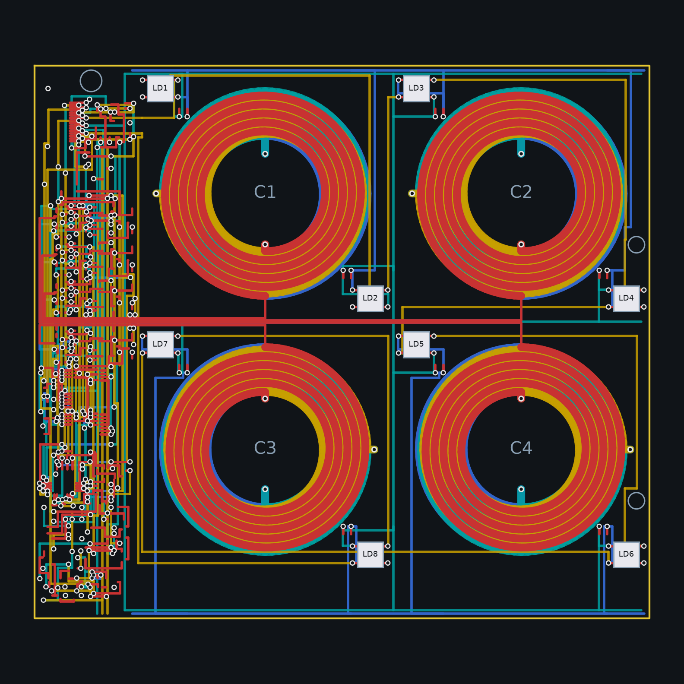
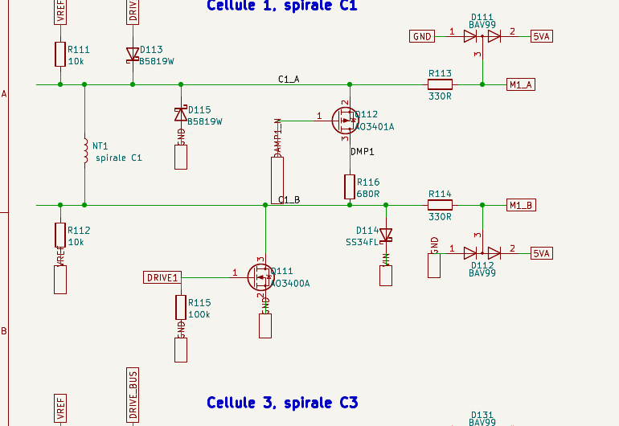
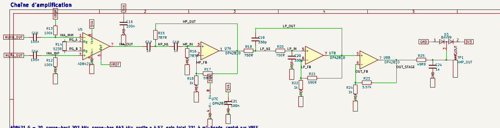
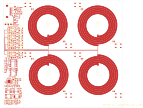
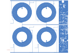

# Quadrant réduit 2 x 2 : banc de mise au point du quadrant



Carte générée par `tools/quadgen` avec l'option `--reduced`, depuis
`config/board.yaml` (`plateau.quadrant.reduced`) : le même circuit, le
même bus de commande et le même firmware que le quadrant 4 x 4
([README](../quadrant/README.md)), avec quatre cases au lieu de seize.
Elle sert à valider le schéma, le frontal et la mesure sur une carte
courte et bon marché avant de commander les quadrants du plateau. La
fonction, les composants et leur câblage sont décrits bloc par bloc
dans la [note 17](../../docs/notes/17-quadrant-fonction-et-cablage.md).

## Ce que contient la carte

- 120 x 108 mm, 4 couches : 20 mm de bande de frontal à l'ouest
  (`plateau.quadrant.front_end_strip_mm`), deux colonnes de cases de
  50 mm, et un dépassement de 8 mm au sud (`reduced.strip_overhang_mm`)
  parce que la bande de frontal, avec une seule bande d'échappée et ses
  quatre cellules, est plus longue que deux cases.
- 4 spirales de détection identiques à celles du 4 x 4 (4 couches en
  série, 5 tours par couche, piste 1,6 mm), bornes au sud de la rangée
  0 et au nord de la rangée 1, échappées dans la bande qui les sépare
  vers les cellules du frontal, borne A sur F.Cu et borne B sur B.Cu.
- 8 WS2812B aux coins NO et SE de chaque case, un 100 nF chacune,
  chaîne de données en serpentin sur In1, grille 5 V sur In2, masse
  sur B.Cu le long des bords nord et sud (pas de couloir médian : dans
  un 2 x 2 le seul couloir est la bande d'échappée). La chaîne ne
  traverse jamais le frontal : elle entre et sort par deux voies
  dessinées au connecteur, une par sens.
- Masse du frontal : un plan sur B.Cu sous toute la bande, à la place
  de l'ancien bus sur In1. Les échappées des bobines le coupent en
  deux, quelques routes de la couche arrière y ouvrent des criques ;
  le build calcule les îlots réellement remplis et les fait recoudre
  ([note 04](../../docs/notes/04-routeur-et-garanties.md)).
- Connecteur FPC 16 broches 0,5 mm (Hirose FH12), brochage dans
  `plateau.quadrant.link.pinout`, identique au 4 x 4 : le cerveau ne
  voit pas la différence, `COILS_PER_QUADRANT` vaut 4 dans son firmware
  de test.
- Trou de pion de centrage en bas de la bande, deux trous de fixation
  M3 au bord est.

## Le frontal de la bande

Le même que sur le 4 x 4, avec les deux points de la note 17 intégrés :

- 4 cellules de 7,4 mm en face de leur bobine : polarisation 10 k vers
  VREF, 330 ohms et BAV99W (SOT-323) devant le mux, diode de bus B5819W
  et AO3400A d'excitation, SS34FL de roue libre vers VIN, **B5819W de
  roue libre depuis la masse** (le courant de la bobine se referme par
  elle quand le N-FET s'ouvre, quel que soit l'état du commutateur de
  rail), AO3401A et 680 ohms d'amortissement pilotés directement par
  le décodeur (plus de rappel vers VIN). Résistances de polarisation et
  d'écrêtage en 0603, amortissement en 0805, rappel de grille en 0402.
- Décodeurs 74HC4514 (excitation, inhibé par PULSE_EN à travers un
  74LVC1G04) et 74HC154 (amortissement, validé par DAMP_EN_N), sorties
  4 à 15 laissées libres ; un seul ADG1607 (bobines 1 à 4, enable
  MUX_EN_L) ; AD8421 G = 20, deux Sallen-Key OPA2810, tampon VREF et
  étage de sortie, écrêtage vers 3V3 et RC de sortie.
- Commutateur de rail d'impulsion AO3401A commandé par un AO3400A,
  **R7 de 470 ohms** pour que le rail se coupe en moins d'une
  microseconde après PULSE_EN, avant la fenêtre d'écoute ; 10 ohms
  2010 vers le bus des cellules.

## Le schéma





`quadrant-2x2.kicad_sch` est la feuille racine (connecteur J1 et les
blocs) ; les feuilles `rails`, `cells-1`, `select`, `chain` et `leds`
dessinent chaque bloc avec ses fils, une étiquette globale pour les
rails, le bus d'adresse et les nets partagés entre feuilles, une
étiquette locale pour les nets internes. Le dessin est vérifié contre
le circuit à chaque build et la netlist relue par `kicad-cli` est
comparée au circuit en test (`tests/test_drawn_schematic.py`).

Sorties du build : projet KiCad avec ses six feuilles, `bom.csv`,
`jlc-bom.csv` (lignes avec code LCSC), `jlc-cpl.csv`, `chain-spice.cir`.

## Résultat du build

Généré par `python -m quadgen build --reduced` (18/09/2026) :

| Bobines | LED | Segments | Vias | Nets ouverts | Pastilles ouvertes | Défauts d'isolement |
|---|---|---|---|---|---|---|
| 4 | 8 | 8706 | 371 | 0 | 0 | 0 |

DRC KiCad 7 (`tools/drc.py`, zones remplies) : 395 signalements,
**zéro erreur et zéro élément non connecté**, contre 117 éléments non
connectés le matin du même jour et sept après le reroutage. Le compte du
build et celui de KiCad disent la même chose, c'est ce que permet la
comptabilité de connexité partagée de la
[note 04](../../docs/notes/04-routeur-et-garanties.md). Avertissements
sans effet sur la fabrication : silk_overlap 151, lib_footprint_issues
129, silk_over_copper 75, track_dangling 25, via_dangling 11,
silk_edge_clearance 4. Le contrôle d'isolement exact du générateur ne
signale aucun défaut.

Les sept dernières liaisons ne relevaient pas du routeur mais de la
géométrie : un chas de 0,475 mm dans le champ d'échappées du connecteur
là où une piste avec ses gardes demande 0,55, deux nappes longues comme
la bande, quatre pastilles de la colonne d'amplification que les deux
rails analogiques enjambent sans laisser la place d'un via, et une
crique du plan de masse. Elles sont tracées dans
`tools/quadgen/hand.py`, avant le routage comme les prises des
cellules, donc le build les redessine et les vérifie à chaque fois, et
le routeur route le reste autour d'elles. Le détail de chacune est dans
la [note 04](../../docs/notes/04-routeur-et-garanties.md).

Deux garde-fous encadrent ces tracés :
`tests/test_quadgen.py::test_reduced_strip_geometry_is_legal_before_routing`
redessine tout le cuivre posé avant le routage et lui applique le
contrôle d'isolement exact en cinq secondes, et le build complet
échoue s'il reste une liaison ouverte.

## Régénérer

```bash
PYTHONPATH=tools .venv/bin/python -m quadgen build --reduced --render docs/images/quadrant-2x2.png
/usr/bin/python3 tools/plot.py hardware/quadrant-2x2/quadrant-2x2.kicad_pcb --out docs/images
/usr/bin/python3 tools/drc.py hardware/quadrant-2x2/quadrant-2x2.kicad_pcb
```

La deuxième commande, avec le Python de KiCad, remplit les pours et
trace les deux faces en SVG ; la troisième compte les éléments non
connectés, qui doivent tomber à zéro avant toute commande.





## Gerbers de fabrication

`quadrant-2x2-gerbers.zip` se dépose tel quel chez le fabricant :
4 couches (F.Cu, In1.Cu, In2.Cu, B.Cu), la pâte de la face
composants, les deux sérigraphies, les deux masques, le contour et les
perçages Excellon séparés (PTH et NPTH), plus le fichier de tâche
`.gbrjob`. 1,6 mm ; les vias d'éventail de 0,45 mm à perçage 0,2 mm
sous les boîtiers fins demandent l'option de perçage minimal 0,2 mm, à
confirmer sur le devis, et un pochoir rend la pose du frontal beaucoup
plus sûre. Options de commande et nomenclature dans la
[note 20](../../docs/notes/20-tuto-banc.md), section 3.

```bash
/usr/bin/python3 tools/gerbers.py hardware/quadrant-2x2/quadrant-2x2.kicad_pcb
```

Avec le Python de KiCad : l'outil remplit les pours d'une copie de la
carte avant de tracer (sans ce remplissage le plan de masse de la
bande sort vide), lit le jeu de couches sur la carte, et refuse
d'exporter tant qu'une pastille reste non connectée. Le dossier
`gerbers/` qu'il écrit n'est pas versionné ; l'archive l'est.
