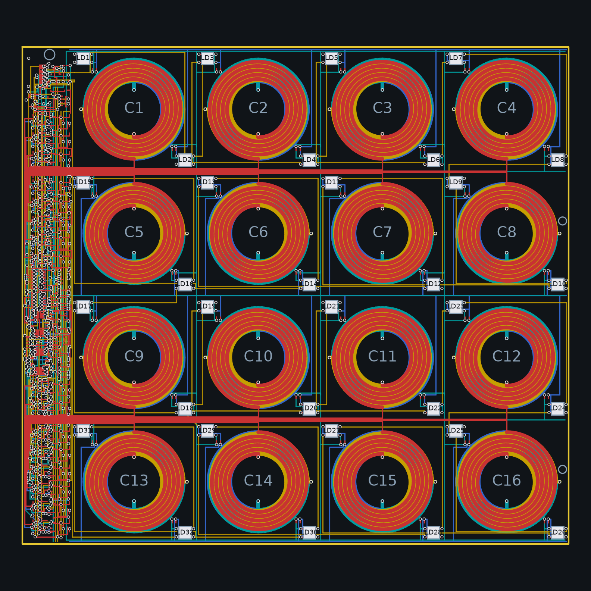

# Quadrant 4 x 4 : carte de détection du plateau 8 x 8



Carte générée par `tools/quadgen` depuis `config/board.yaml`
(ADR 0010). Quatre exemplaires identiques dallent l'aire de jeu ; la
paire de droite est montée tournée de 180 degrés, ce qui laisse la
diagonale des LED inchangée et met la bande de frontal au bord extérieur.

## Ce que contient la carte

- 220 x 200 mm, 4 couches : 20 mm de bande de frontal à l'ouest
  (`plateau.quadrant.front_end_strip_mm`, couverte par la bordure de
  bois de même largeur), puis quatre colonnes de cases de 50 mm, soit
  4 p plus la bande sur 4 p.
- 16 spirales de détection (4 couches en série, 5 tours par couche,
  piste 1,6 mm), bornes empilées au nord des rangées impaires et au
  sud des rangées paires : chaque paire de rangées s'échappe dans le
  couloir qui les sépare (« bande »), huit voies par bande, vers les
  cellules du frontal, borne A sur F.Cu et borne B sur B.Cu.
- 32 WS2812B aux coins NO et SE de chaque case, un 100 nF chacune,
  vias latérales, chaîne de données sur In1 en serpentin (rangée 0 vers
  l'est, rangée 1 vers l'ouest, et ainsi de suite), grille 5 V sur
  In2, masse sur B.Cu (bords nord et sud, couloir médian) reliée au
  bus de la bande sur In1. Chaîne et retours sont routés par un A* sur
  grille de 0,2 mm contre tout le cuivre déjà posé.
- Connecteur FPC 16 broches 0,5 mm (Hirose FH12, 1,4 mm de haut, câble
  sortant à l'ouest), brochage dans `plateau.quadrant.link.pinout`.
- Trou de pion de centrage en bas de la bande, deux trous de fixation
  M3 au bord est, dans les zones libres de vias LED.

Le contrôle d'isolement exact (shapely) tourne à chaque build et le
projet KiCad porte les règles du générateur, vias d'éventail comprises ;
le DRC de KiCad se lance par `tools/drc.py` (module `pcbnew`, voir la
[note 14](../../docs/notes/14-revue-des-cartes.md)) ou après ouverture.
Le build échoue si une route de la chaîne LED, un retour d'alimentation
ou un net du frontal reste ouvert : la liste imprimée est ce qu'il reste
à fermer dans pcbnew.

## Le frontal de la bande

- 16 cellules de 7,4 mm en face de leur bobine, réparties de part et
  d'autre de chaque bande d'échappée : bleed 10 k vers VREF, 330 ohms
  et BAV99W (SOT-323) devant le mux, diode de bus B5819W et AO3400A
  d'excitation, SS34FL de roue libre vers VIN (SOD-123F, 1 mm de haut),
  B5819W de roue libre depuis la masse (point 1 de la
  [note 17](../../docs/notes/17-quadrant-fonction-et-cablage.md) : le
  courant de la bobine se referme par elle quand le N-FET s'ouvre, et
  R7 de 470 ohms coupe le rail en moins d'une microseconde), AO3401A et
  680 ohms d'amortissement pilotés directement par le décodeur (point 2,
  plus de rappel vers VIN), pulldown de grille 0402. Les colonnes de la cellule sont
  empilées à partir des cours réelles des empreintes et contrôlées
  contre le pas de 7,4 mm. L'entrée A arrive sur F.Cu à y - 0,6,
  l'entrée B sur B.Cu à y + 0,6 avec sa via.
- Zone médiane de 43,8 mm : 74HC4514 (excitation, inhibé par PULSE_EN
  à travers un 74LVC1G04) et 74HC154 (amortissement, validé par
  DAMP_EN_N), deux ADG1607 (bobines 1 à 8, 9 à 16, sorties en
  parallèle, un enable chacun, bus d'adresses A0..A2 partagé), AD8421
  G = 20, OPA2810 en Sallen-Key passe-haut et passe-bas, OPA2810 en
  tampon VREF et étage de sortie, écrêtage vers 3V3 et RC de sortie.
- Zone du milieu (43,8 mm entre les deux groupes de cellules, ancrée
  aux bandes d'échappée), du haut vers le bas : les deux décodeurs
  TSSOP empilés (le 74HC154 tourné de 180 degrés, adresses à l'ouest,
  sorties des bobines 1 à 11 à l'est, du côté des grilles), chacune de
  leurs vingt-quatre broches prolongée sous le boîtier jusqu'à un via
  (quatre colonnes au pas double des pastilles) ; le mux des bobines 1
  à 8, tourné de 270 degrés, ses seize entrées dessinées à la main en
  éventails (voies au pas de 0,6 mm, vias dans deux colonnes par côté) ;
  les deux amplificateurs côte à côte, broches échappées sous le
  boîtier ; le mux des bobines 9 à 16 et ses éventails. Tous les
  boîtiers à vias sont dans la bande ouest ; les passifs occupent la
  bande est, entre le rail 3V3 et le bord, par affinité.
- Zone du connecteur (25,7 mm) : FPC 16 broches, commutateur de rail
  d'impulsion (AO3401A, AO3400A, et la 10 ohms 2010 à côté), réserve
  10 µF, l'étage de sortie (OPA2810 avec ses résistances et son
  condensateur) pour que seul le signal filtré traverse la bande ; le
  point de test de sortie y reste, ceux de VREF et du bus d'excitation
  sont au pied de la bande, à côté de leur bus.
- Bus sur In1 côté est : 5VA, VREF, DRIVE_BUS, VIN et GND ; 3V3 et
  5V_LED sur In2. Les lignes de mesure M{k} vers les mux et les lignes
  de grille des décodeurs sont routées par le routeur A* multicouche
  depuis les vias dessinés à la main, un rip-up cherche le mur de
  chaque net resté en morceaux, puis un contrôle d'isolement exact
  valide toute la carte.
- Les vias d'empilement des bobines sont décalées radialement hors des
  bandes de spires (1,3 mm dans le creux ou au-delà du rayon extérieur,
  reliées par un tronçon radial) : posées sur le rayon même, elles
  recouvraient les spires des autres couches et court-circuitaient la
  bobine. La dernière jonction (In2 vers B.Cu) descend à 3,5 mm dans le
  creux et son tronçon radial porte le « net tie » (`quadgen:COIL_TIE`) :
  couches 1 à 3, vias et début du tronçon sur C{k}_A, deux pastilles
  B.Cu carrées qui se touchent, puis la suite du tronçon, l'arc
  d'entrée, la spirale de la couche 4 et l'échappée B sur C{k}_B, le
  tout à la largeur de spire. Aucun cuivre d'un net ne recouvre un trou
  de l'autre, ce que le DRC de KiCad exige même dans un net tie. Le
  schéma montre le même NT{k}.

Sorties du build : projet KiCad avec son schéma dessiné (feuille racine
`quadrant.kicad_sch` avec J1 et les blocs, puis `rails`, `cells-1` à
`cells-4`, `select`, `chain`, `leds`, fils tracés entre les composants,
fonction et câblage dans la note 17 ; aperçus dans le
[README du 2 x 2](../quadrant-2x2/README.md)), `bom.csv`, `jlc-bom.csv`
(lignes avec code LCSC), `jlc-cpl.csv`, `chain-spice.cir`.

## Régénérer

```bash
PYTHONPATH=tools .venv/bin/python -m quadgen build --render docs/images/quadrant.png
```

## Résultat du build

Généré par `python -m quadgen build` le 04/10/2026, avec les éventails
et les échappées dessinés à la main, le rip-up par recherche du mur et
la passe de finition partagée
([note 04](../../docs/notes/04-routeur-et-garanties.md)) :

| Bobines | LED | Segments | Vias | Raccords de la passe | Routes LED et alimentation ouvertes | Nets ouverts | Défauts d'isolement |
|---|---|---|---|---|---|---|---|
| 16 | 32 | 33171 | 946 | 15 | 0 | 24 | 0 |

Le build commité du 20/09 en laissait 47 ; les éventails des
multiplexeurs, les échappées sous boîtier des décodeurs et des
amplificateurs, l'étage de sortie ramené à la liaison, le 74HC154
tourné et le rip-up par recherche du mur ont fermé le reste, dans
l'ordre raconté par la note 04. Ce qui reste ouvert : douze lignes de
grille (DRIVE 2, 3, 10, 11, 12, 14, 15 et DAMP 2, 3, 9, 10, 16), neuf
lignes M (bobines 1, 2, 3 et 5 des deux côtés, 14 B), le retour du
filtre vers l'étage de sortie (LP_OUT), la référence en huit pièces et
un îlot du plan de masse. La cause est mesurée
voie par voie dans la note 04 : dans les rangées de la dernière cellule
de la bande 0 et sous les décodeurs, la bande de 20 mm offre à peu près
autant de voies que de lignes à faire passer, et un routeur séquentiel
n'emplit pas un couloir ; le rip-up trouve le mur de chaque net, deux à
cinq nets, et une levée sur deux est défaite faute de place pour ce
qu'elle soulève. Les options restantes (autoroutes à la main pour les
cellules lointaines, bande de 24 mm, six couches, cellule allégée) sont
des décisions de conception.

Aucune archive de fabrication : `tools/gerbers.py` refuse une carte au
routage ouvert.

DRC KiCad 7 (`tools/drc.py`, zones remplies) : 686 signalements, 31 éléments non connectés (les 24 nets ouverts ci-dessus), erreurs restantes : aucune ; avertissements sans effet sur la fabrication : lib_footprint_issues 199, silk_over_copper 199, silk_overlap 199, via_dangling 60, track_dangling 28, silk_edge_clearance 1. Le contrôle d'isolement exact du générateur ne signale aucun défaut. Les vias d'éventail et d'échappée font 0,45 mm (perçage 0,2 mm), dans les capacités standard de JLCPCB, à confirmer sur le devis.
